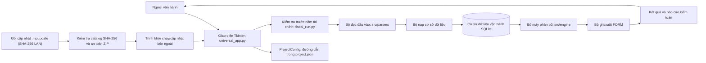
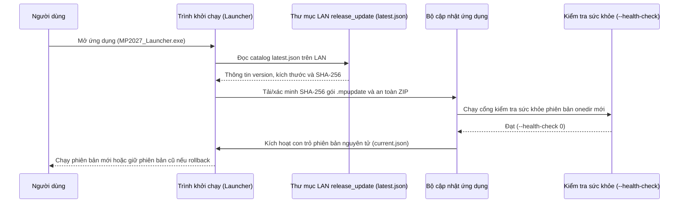

# MP2027 Manager — Bản đồ kiến trúc kỹ thuật

> **Document Control**: Owner: MP Engineering | Status: Approved / Production-Ready | Last Updated: 2026-09-01 | Release Flow: `HASH_ONLY_LAN`

Đây là bản đồ bàn giao phản ánh trạng thái hiện tại, không phải yêu cầu tái cấu trúc các quy tắc nghiệp vụ.

## Phạm vi hệ thống

MP2027 Manager là ứng dụng desktop Windows đọc các nguồn Excel/CSV đã được chọn lọc, xác định đầu vào theo năm tài chính, nạp dữ liệu chuẩn hóa vào SQLite, tính toán phân bổ và ghi các workbook FORM theo từng trung tâm chi phí.



## Trách nhiệm của các thành phần

| Khối | Vị trí chính | Trách nhiệm | Không được phụ trách |
|---|---|---|---|
| Giao diện / lớp vỏ | `src/universal_app.py` | Thao tác người dùng, hộp thoại, điều phối lượt chạy | Công thức mới không có test bộ máy |
| Cấu hình dự án/đường dẫn | `src/services/project_config.py` | Đường dẫn tương đối và vai trò lưu trữ | Quyết định phân bổ |
| Kiểm tra trước năm tài chính | `src/services/fiscal_run.py` | Bằng chứng nguồn/năm tài chính; từ chối an toàn | Tự tạo dữ liệu nguồn còn thiếu |
| Bộ đọc dữ liệu | `src/parsers/` | Đọc cấu trúc workbook/CSV | Định dạng kết quả |
| Cơ sở dữ liệu | `src/db/` | Schema, migration, nhập dữ liệu | Quyết định giao diện |
| Bộ máy nghiệp vụ | `src/engine/` | Driver, ánh xạ tài khoản, phân bổ, bộ ghi | Đường dẫn phụ thuộc máy |
| Dịch vụ | `src/services/` | Lịch sử, kiểm tra sức khỏe, cập nhật, nhân sự | Dữ liệu dự phòng chưa được xác minh |
| Công cụ kiểm toán | `src/audit/`, `scripts/` | Bằng chứng và xác minh | Mặc định làm thay đổi kết quả |
| Đóng gói | `packaging/`, `scripts/package_app.py` | PyInstaller onedir và cổng kiểm tra sức khỏe | Dữ liệu runtime trong gói |
| Test | `tests/` | Bằng chứng hồi quy và hợp đồng | Là đặc tả nghiệp vụ duy nhất |

## Lượt chạy thông thường

1. Mở giao diện qua `run_MP2027.bat` hoặc tệp thực thi đã đóng gói.
2. Xác định vùng lưu trữ qua `project.json` và thư mục gốc runtime ổn định.
3. Chạy kiểm tra trước đối với loại nguồn, bằng chứng năm tài chính và đầu vào còn thiếu.
4. Đọc nguồn và nạp dữ liệu chuẩn hóa vào SQLite.
5. Tính driver, ánh xạ tài khoản và phân bổ.
6. Giữ nguyên cấu trúc FORM và xuất workbook theo từng trung tâm chi phí.
7. Xem báo cáo kiểm toán và đầu vào còn thiếu trước khi chấp nhận kết quả.

## Luồng cập nhật (HASH_ONLY_LAN)



Dự án áp dụng chính sách `HASH_ONLY_LAN`: không tạo, tìm, khôi phục hoặc cấu hình khóa ký hay chữ ký gói. An toàn phát hành dựa trên thư mục LAN do công ty kiểm soát và kiểm tra SHA-256 hai đầu (`latest.json` + `manifest.json`).

## Các mô-đun rủi ro cao

- `src/universal_app.py`: bề mặt giao diện/điều phối lớn; chỉ thay đổi theo từng điểm nối nhỏ.
- `src/engine/allocator.py`: hành vi phân bổ trung tâm; phải được bảo vệ bằng test đặc trưng hóa.
- `src/engine/hub_builder.py`: bề mặt điều phối dựng/xuất lớn.
- `src/services/fiscal_run.py`: chính sách nguồn và năm tài chính từ chối an toàn.
- `src/db/schema.py` và `src/db/migrations.py`: ranh giới tương thích lưu trữ.

## Bất biến đóng gói

- Không có dữ liệu thay đổi được dưới `_MEIPASS` của PyInstaller.
- Thư mục gốc mặc định khi đóng gói: `%LOCALAPPDATA%\MPManager\Projects\MP2027`.
- Chế độ portable phải được bật rõ ràng bằng `MP_MANAGER_PORTABLE_MODE=1`.
- Bản phân phối dùng onedir, không dùng onefile.
- Cổng đóng gói xác minh tài nguyên và chạy `--health-check`.
- Kết quả, cơ sở dữ liệu, log và tệp tạm không phải là artifact nguồn phát hành.

## Bố cục phát hành

```text
<install-root>/
├── MP2027_Launcher.exe
├── current.json
├── _internal/
└── apps/<version>/
    ├── manifest.json
    ├── MP2027_Portable.exe
    └── _internal/
```

Trình khởi chạy ổn định đọc `current.json` được bảo vệ tính toàn vẹn, xác định phiên bản bất biến đang hoạt động và chạy tệp thực thi đó mà không cần Python. Định nghĩa Inno Setup cài cây thư mục này theo từng người dùng dưới `%LOCALAPPDATA%` để bản cập nhật có thể chuẩn bị và chuyển phiên bản theo cách nguyên tử mà không cần quyền quản trị. Dữ liệu dự án thay đổi được nằm riêng trong thư mục gốc dự án MPManager và không thuộc phạm vi rollback phiên bản. Ranh giới tin cậy là thư mục mạng LAN do công ty kiểm soát và xác minh SHA-256; không sử dụng khóa ký số.

## Chính sách VC++ runtime

PyInstaller mang theo Python runtime và các phụ thuộc nhị phân được phát hiện trong gói onedir. Bộ cài không âm thầm tải hoặc cài VC++ redistributable. Việc xác minh phát hành phải chạy trên một bản Windows sạch được hỗ trợ; nếu kiểm tra phụ thuộc hoặc phép thử đó chứng minh cần redistributable, hãy cố định phiên bản và đóng kèm bản redistributable offline được Microsoft hỗ trợ.

## Ranh giới tin cậy phát hành

1. Thư mục chia sẻ LAN được kiểm soát là ranh giới tin cậy duy nhất (`HASH_ONLY_LAN`).
2. Catalog `release_update/latest.json` và `manifest.json` trong từng gói quản lý version, kích thước và mã băm SHA-256.
3. Luồng kiểm tra sức khỏe `--health-check` đảm bảo ứng dụng chạy tốt trên môi trường cách ly trước khi kích hoạt.
4. Mọi lần phát hành bắt buộc phải tuân theo hướng dẫn chi tiết tại `docs/handover/release_update_playbook.md`.

## Bằng chứng đóng gói hiện tại

Bản build onedir cho ứng dụng/trình khởi chạy bằng PyInstaller hiện đã hoàn tất, bao gồm `--health-check` ở môi trường đóng gói cách ly và việc tạo `release_artifacts/install_bundle`. Điều này chứng minh hợp đồng trên máy build, chưa chứng minh khả năng tương thích với máy sạch.
