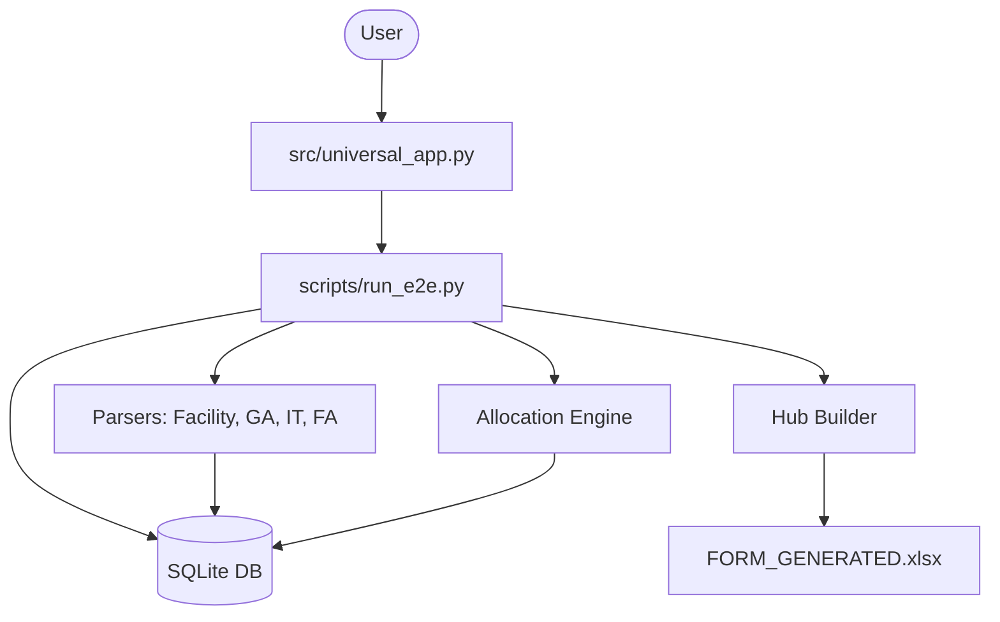

# System Architecture - MP2027 Manager

## Overview
Hệ thống là một công cụ tự động hóa lập ngân sách (Master Plan) được chuyển đổi từ quy trình Excel thủ công sang mô hình **Hub-and-Spoke** dựa trên Python và SQLite.

## Cấu trúc các Layer

### 1. GUI Layer (`src/universal_app.py`)
- Sử dụng **Tkinter** để cung cấp giao diện người dùng.
- Cho phép nhập Năm tài chính, chọn File Template và Thư mục nguồn.
- Cung cấp Log thời gian thực và thông báo kết quả.

### 2. Orchestration Layer (`scripts/run_e2e.py`)
- Hàm `run_universal_pipeline` điều phối toàn bộ luồng xử lý.
- Quản lý vòng đời Database và thứ tự chạy các module.

### 3. Data Ingestion Layer (`src/parsers/`)
- **Facility Parser**: Xử lý chi phí hạ tầng (Điện, nước, khấu hao tòa nhà).
- **GA Parser**: Xử lý chi phí hành chính và định mức nhân sự.
- **IT Sim Parser**: Xử lý 3 giai đoạn chi phí bản quyền phần mềm.
- **Fixed Assets Parser**: Xử lý 119,000+ dòng khấu hao tài sản.

### 4. Logic Layer (`src/engine/`)
- **Allocation Engine**: Phân bổ chi phí từ input thô sang các Cost Center đích dựa trên Driver (Headcount, Working Days).
- **Hub Builder**: Pivot dữ liệu từ Database thành cấu trúc 12 tháng ngang để đổ vào Excel.

### 5. Storage Layer (`data/mp2027.db`)
- SQLite database lưu trữ Master Data, Rules, và Transactional Data (Hub).

## Diagram

