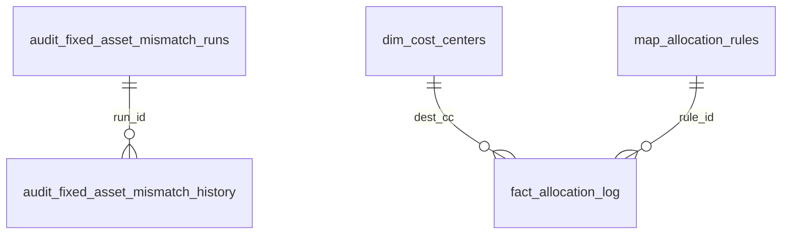

# Từ điển dữ liệu SQLite MP2027

> Được tạo từ cơ sở dữ liệu trong bộ nhớ. Không đọc hoặc đưa dữ liệu người dùng/runtime vào báo cáo.

Phiên bản schema: **1**

## Quan hệ thực thể



## Nhóm bảng

- `dim_*`: các danh mục tham khảo.
- `map_*`: ánh xạ nghiệp vụ và điều kiện áp dụng.
- `fact_*`: đầu vào chuẩn hóa, yếu tố phân bổ, phép tính và dữ liệu thiếu.
- `audit_*`: bản ghi truy vết/bằng chứng; không phải đầu vào tính toán chính.
- `sys_*` và `schema_migrations`: cấu hình ứng dụng và vòng đời schema.

## `audit_fixed_asset_import_rows`

| Cột | Kiểu | Bắt buộc | Khóa chính | Mặc định |
|---|---|---:|---:|---|
| `id` | `INTEGER` | không | có | `` |
| `fiscal_year` | `INTEGER` | có | không | `` |
| `source_snapshot` | `TEXT` | có | không | `` |
| `source_file` | `TEXT` | có | không | `` |
| `source_sheet` | `TEXT` | có | không | `` |
| `source_row` | `INTEGER` | có | không | `` |
| `asset_no` | `TEXT` | không | không | `` |
| `asset_text` | `TEXT` | không | không | `` |
| `category_raw` | `TEXT` | không | không | `` |
| `category_key` | `TEXT` | không | không | `` |
| `control_cc` | `TEXT` | không | không | `` |
| `depreciation_cc` | `TEXT` | không | không | `` |
| `monthly_depr_usd` | `REAL` | không | không | `` |
| `terminal_period` | `TEXT` | không | không | `` |
| `terminal_depr_usd` | `REAL` | không | không | `` |
| `apr_interest_usd` | `REAL` | không | không | `` |
| `may_interest_usd` | `REAL` | không | không | `` |
| `formula_cache_status` | `TEXT` | có | không | `` |
| `inclusion_status` | `TEXT` | có | không | `` |
| `exclusion_reason` | `TEXT` | không | không | `` |
| `imported_at` | `TIMESTAMP` | không | không | `CURRENT_TIMESTAMP` |

## `audit_fixed_asset_mismatch_history`

| Cột | Kiểu | Bắt buộc | Khóa chính | Mặc định |
|---|---|---:|---:|---|
| `id` | `INTEGER` | không | có | `` |
| `run_id` | `TEXT` | có | không | `` |
| `fiscal_year` | `INTEGER` | có | không | `` |
| `cc_code` | `TEXT` | có | không | `` |
| `account_code` | `INTEGER` | có | không | `` |
| `period` | `TEXT` | có | không | `` |
| `expected_vnd` | `INTEGER` | không | không | `` |
| `reference_vnd` | `INTEGER` | không | không | `` |
| `delta_vnd` | `INTEGER` | không | không | `` |
| `reference_formula_kind` | `TEXT` | không | không | `` |
| `source_asset_count` | `INTEGER` | có | không | `` |
| `evidence_classification` | `TEXT` | có | không | `` |
| `decision_status` | `TEXT` | có | không | `` |
| `allowed_action` | `TEXT` | có | không | `` |
| `classification_reason` | `TEXT` | có | không | `` |
| `source_evidence_json` | `TEXT` | có | không | `` |
| `reference_evidence_json` | `TEXT` | có | không | `` |
| `created_at` | `TIMESTAMP` | không | không | `CURRENT_TIMESTAMP` |

Khóa ngoại:
- `run_id` -> `audit_fixed_asset_mismatch_runs.run_id`

## `audit_fixed_asset_mismatch_runs`

| Cột | Kiểu | Bắt buộc | Khóa chính | Mặc định |
|---|---|---:|---:|---|
| `run_id` | `TEXT` | không | có | `` |
| `audit_date` | `TEXT` | có | không | `` |
| `executed_at` | `TEXT` | có | không | `` |
| `matrix_sha256` | `TEXT` | có | không | `` |
| `matrix_csv_path` | `TEXT` | có | không | `` |
| `matrix_report_path` | `TEXT` | có | không | `` |
| `history_snapshot_dir` | `TEXT` | có | không | `` |
| `summary_json` | `TEXT` | có | không | `` |
| `created_at` | `TIMESTAMP` | không | không | `CURRENT_TIMESTAMP` |

## `audit_headcount_source_decisions`

| Cột | Kiểu | Bắt buộc | Khóa chính | Mặc định |
|---|---|---:|---:|---|
| `id` | `INTEGER` | không | có | `` |
| `fiscal_year` | `INTEGER` | có | không | `` |
| `source_file` | `TEXT` | có | không | `` |
| `cc_code` | `TEXT` | có | không | `` |
| `displayed_name` | `TEXT` | không | không | `` |
| `name_jp` | `TEXT` | không | không | `` |
| `name_vn` | `TEXT` | không | không | `` |
| `decision` | `TEXT` | có | không | `` |
| `reason` | `TEXT` | có | không | `` |
| `decided_at` | `TIMESTAMP` | không | không | `CURRENT_TIMESTAMP` |

## `audit_uniform_cup_calculation`

| Cột | Kiểu | Bắt buộc | Khóa chính | Mặc định |
|---|---|---:|---:|---|
| `id` | `INTEGER` | không | có | `` |
| `fiscal_year` | `INTEGER` | có | không | `` |
| `cc_code` | `TEXT` | có | không | `` |
| `period` | `TEXT` | có | không | `` |
| `item_key` | `TEXT` | có | không | `` |
| `item_name` | `TEXT` | có | không | `` |
| `release_type` | `TEXT` | có | không | `` |
| `source_periods` | `TEXT` | không | không | `` |
| `new_staff` | `REAL` | có | không | `0` |
| `new_worker` | `REAL` | có | không | `0` |
| `total_new_hires` | `REAL` | có | không | `0` |
| `issue_quantity` | `REAL` | có | không | `0` |
| `unit_price` | `REAL` | có | không | `0` |
| `amount_vnd` | `REAL` | có | không | `0` |
| `account_code` | `INTEGER` | không | không | `` |
| `rule_id` | `INTEGER` | không | không | `` |
| `entitlement_source_file` | `TEXT` | không | không | `` |
| `entitlement_source_sheet` | `TEXT` | không | không | `` |
| `entitlement_source_cell` | `TEXT` | không | không | `` |
| `formula_expr` | `TEXT` | không | không | `` |
| `status` | `TEXT` | có | không | `'OK'` |
| `created_at` | `TIMESTAMP` | không | không | `CURRENT_TIMESTAMP` |

## `dim_accounts`

| Cột | Kiểu | Bắt buộc | Khóa chính | Mặc định |
|---|---|---:|---:|---|
| `code` | `INTEGER` | không | có | `` |
| `name_jp` | `TEXT` | có | không | `` |
| `name_vn` | `TEXT` | không | không | `` |
| `group_name` | `TEXT` | không | không | `` |
| `group_vn` | `TEXT` | không | không | `` |
| `mfg_code` | `INTEGER` | không | không | `` |
| `ga_code` | `INTEGER` | không | không | `` |
| `sales_code` | `INTEGER` | không | không | `` |
| `remark` | `TEXT` | không | không | `` |
| `created_at` | `TIMESTAMP` | không | không | `CURRENT_TIMESTAMP` |

## `dim_cost_centers`

| Cột | Kiểu | Bắt buộc | Khóa chính | Mặc định |
|---|---|---:|---:|---|
| `code` | `TEXT` | không | có | `` |
| `name_jp` | `TEXT` | có | không | `` |
| `name_vn` | `TEXT` | không | không | `` |
| `seq_no` | `REAL` | không | không | `` |
| `saisan_type` | `TEXT` | có | không | `` |
| `cost_type` | `TEXT` | có | không | `` |
| `staff_count` | `INTEGER` | không | không | `0` |
| `worker_count` | `INTEGER` | không | không | `0` |
| `created_at` | `TIMESTAMP` | không | không | `CURRENT_TIMESTAMP` |

## `fact_allocation_log`

| Cột | Kiểu | Bắt buộc | Khóa chính | Mặc định |
|---|---|---:|---:|---|
| `id` | `INTEGER` | không | có | `` |
| `rule_id` | `INTEGER` | có | không | `` |
| `dest_cc` | `TEXT` | có | không | `` |
| `period` | `TEXT` | có | không | `` |
| `amount_vnd` | `REAL` | có | không | `` |
| `account_code` | `INTEGER` | có | không | `` |
| `driver_value` | `REAL` | có | không | `` |
| `driver_total` | `REAL` | có | không | `` |
| `step` | `INTEGER` | không | không | `1` |
| `created_at` | `TIMESTAMP` | không | không | `CURRENT_TIMESTAMP` |

Khóa ngoại:
- `dest_cc` -> `dim_cost_centers.code`
- `rule_id` -> `map_allocation_rules.id`

## `fact_bus_headcount_drivers`

| Cột | Kiểu | Bắt buộc | Khóa chính | Mặc định |
|---|---|---:|---:|---|
| `cc_code` | `TEXT` | không | có | `` |
| `fiscal_year` | `INTEGER` | có | không | `0` |
| `bus_expat_count` | `REAL` | không | không | `0` |
| `bus_vietnamese_count` | `REAL` | không | không | `0` |
| `source` | `TEXT` | không | không | `"manual"` |
| `description` | `TEXT` | không | không | `` |
| `created_at` | `TIMESTAMP` | không | không | `CURRENT_TIMESTAMP` |

## `fact_ga_monthly_rates`

| Cột | Kiểu | Bắt buộc | Khóa chính | Mặc định |
|---|---|---:|---:|---|
| `id` | `INTEGER` | không | có | `` |
| `item_key` | `TEXT` | có | không | `` |
| `item_name` | `TEXT` | có | không | `` |
| `period` | `TEXT` | có | không | `` |
| `unit_price` | `REAL` | có | không | `` |
| `mfg_account` | `INTEGER` | không | không | `` |
| `ga_account` | `INTEGER` | không | không | `` |
| `sales_account` | `INTEGER` | không | không | `` |
| `source` | `TEXT` | không | không | `"ga"` |
| `created_at` | `TIMESTAMP` | không | không | `CURRENT_TIMESTAMP` |

## `fact_headcount_time_source`

| Cột | Kiểu | Bắt buộc | Khóa chính | Mặc định |
|---|---|---:|---:|---|
| `period` | `TEXT` | có | có | `` |
| `cc_code` | `TEXT` | có | có | `` |
| `fixed_hours_expat` | `REAL` | không | không | `0` |
| `fixed_hours_local` | `REAL` | không | không | `0` |
| `overtime_hours_expat` | `REAL` | không | không | `0` |
| `overtime_hours_local` | `REAL` | không | không | `0` |
| `source_file` | `TEXT` | không | không | `` |
| `source_sheet` | `TEXT` | không | không | `` |
| `source_cells` | `TEXT` | không | không | `` |
| `imported_at` | `TIMESTAMP` | không | không | `CURRENT_TIMESTAMP` |

## `fact_input_data`

| Cột | Kiểu | Bắt buộc | Khóa chính | Mặc định |
|---|---|---:|---:|---|
| `id` | `INTEGER` | không | có | `` |
| `source` | `TEXT` | có | không | `` |
| `period` | `TEXT` | có | không | `` |
| `amount_vnd` | `REAL` | có | không | `0` |
| `amount_usd` | `REAL` | không | không | `NULL` |
| `cc_code` | `INTEGER` | có | không | `` |
| `account_code` | `INTEGER` | có | không | `` |
| `form_row` | `INTEGER` | không | không | `NULL` |
| `fiscal_year` | `INTEGER` | không | không | `NULL` |
| `source_snapshot` | `TEXT` | không | không | `NULL` |
| `scenario_id` | `TEXT` | không | không | `'base'` |
| `description` | `TEXT` | không | không | `` |
| `created_at` | `TIMESTAMP` | không | không | `CURRENT_TIMESTAMP` |

## `fact_manual_headcount_baseline_override`

| Cột | Kiểu | Bắt buộc | Khóa chính | Mặc định |
|---|---|---:|---:|---|
| `period` | `TEXT` | có | có | `` |
| `cc_code` | `TEXT` | có | có | `` |
| `fiscal_year` | `INTEGER` | có | không | `0` |
| `headcount_all` | `REAL` | không | không | `0` |
| `headcount_expat` | `REAL` | không | không | `0` |
| `headcount_staff` | `REAL` | không | không | `0` |
| `headcount_worker` | `REAL` | không | không | `0` |
| `headcount_male` | `REAL` | không | không | `0` |
| `headcount_female` | `REAL` | không | không | `0` |
| `split_status` | `TEXT` | không | không | `"READY"` |
| `headcount_local_total` | `REAL` | không | không | `` |
| `description` | `TEXT` | không | không | `` |
| `source_file` | `TEXT` | không | không | `` |
| `source_sheet` | `TEXT` | không | không | `` |
| `updated_at` | `TIMESTAMP` | không | không | `CURRENT_TIMESTAMP` |

## `fact_manual_headcount_time_override`

| Cột | Kiểu | Bắt buộc | Khóa chính | Mặc định |
|---|---|---:|---:|---|
| `period` | `TEXT` | có | có | `` |
| `cc_code` | `TEXT` | có | có | `` |
| `fiscal_year` | `INTEGER` | có | không | `0` |
| `fixed_hours_expat` | `REAL` | không | không | `0` |
| `fixed_hours_local` | `REAL` | không | không | `0` |
| `overtime_hours_expat` | `REAL` | không | không | `0` |
| `overtime_hours_local` | `REAL` | không | không | `0` |
| `description` | `TEXT` | không | không | `` |
| `updated_at` | `TIMESTAMP` | không | không | `CURRENT_TIMESTAMP` |

## `fact_missing_inputs`

| Cột | Kiểu | Bắt buộc | Khóa chính | Mặc định |
|---|---|---:|---:|---|
| `id` | `INTEGER` | không | có | `` |
| `severity` | `TEXT` | có | không | `'action'` |
| `cc_code` | `TEXT` | không | không | `` |
| `period` | `TEXT` | không | không | `` |
| `area` | `TEXT` | có | không | `` |
| `message` | `TEXT` | có | không | `` |
| `action` | `TEXT` | có | không | `` |
| `source` | `TEXT` | có | không | `'system'` |
| `rule_id` | `INTEGER` | không | không | `NULL` |
| `created_at` | `TIMESTAMP` | không | không | `CURRENT_TIMESTAMP` |

## `fact_monthly_headcount`

| Cột | Kiểu | Bắt buộc | Khóa chính | Mặc định |
|---|---|---:|---:|---|
| `id` | `INTEGER` | không | có | `` |
| `period` | `TEXT` | có | không | `` |
| `cc_code` | `TEXT` | có | không | `` |
| `headcount_all` | `REAL` | không | không | `0` |
| `headcount_expat` | `REAL` | không | không | `0` |
| `headcount_staff` | `REAL` | không | không | `0` |
| `headcount_worker` | `REAL` | không | không | `0` |
| `headcount_male` | `REAL` | không | không | `0` |
| `headcount_female` | `REAL` | không | không | `0` |
| `split_status` | `TEXT` | không | không | `"READY"` |
| `headcount_local_total` | `REAL` | không | không | `` |
| `source` | `TEXT` | không | không | `"hr"` |
| `description` | `TEXT` | không | không | `` |
| `source_file` | `TEXT` | không | không | `` |
| `source_sheet` | `TEXT` | không | không | `` |
| `imported_at` | `TIMESTAMP` | không | không | `` |
| `created_at` | `TIMESTAMP` | không | không | `CURRENT_TIMESTAMP` |

## `map_allocation_rules`

| Cột | Kiểu | Bắt buộc | Khóa chính | Mặc định |
|---|---|---:|---:|---|
| `id` | `INTEGER` | không | có | `` |
| `source_dept` | `TEXT` | có | không | `` |
| `item_name` | `TEXT` | có | không | `` |
| `account_name` | `TEXT` | không | không | `` |
| `mfg_account` | `INTEGER` | không | không | `` |
| `ga_account` | `INTEGER` | không | không | `` |
| `sales_account` | `INTEGER` | không | không | `` |
| `posting_month` | `TEXT` | không | không | `` |
| `unit_price` | `REAL` | có | không | `` |
| `unit` | `TEXT` | không | không | `` |
| `driver_type` | `TEXT` | có | không | `` |
| `driver_raw` | `TEXT` | không | không | `` |
| `created_at` | `TIMESTAMP` | không | không | `CURRENT_TIMESTAMP` |

## `map_cost_center_uniform_items`

| Cột | Kiểu | Bắt buộc | Khóa chính | Mặc định |
|---|---|---:|---:|---|
| `cc_code` | `TEXT` | có | có | `` |
| `item_key` | `TEXT` | có | có | `` |
| `item_name` | `TEXT` | có | không | `` |
| `eligible` | `INTEGER` | có | không | `0` |
| `source_file` | `TEXT` | có | không | `` |
| `source_sheet` | `TEXT` | có | không | `` |
| `source_cell` | `TEXT` | có | không | `` |
| `imported_at` | `TIMESTAMP` | không | không | `CURRENT_TIMESTAMP` |

## `schema_migrations`

| Cột | Kiểu | Bắt buộc | Khóa chính | Mặc định |
|---|---|---:|---:|---|
| `version` | `INTEGER` | không | có | `` |
| `name` | `TEXT` | có | không | `` |
| `applied_at` | `TEXT` | có | không | `` |
| `application_version` | `TEXT` | có | không | `'unknown'` |

## `sys_params`

| Cột | Kiểu | Bắt buộc | Khóa chính | Mặc định |
|---|---|---:|---:|---|
| `key` | `TEXT` | không | có | `` |
| `value` | `TEXT` | có | không | `` |
| `description` | `TEXT` | không | không | `` |
| `updated_at` | `TIMESTAMP` | không | không | `CURRENT_TIMESTAMP` |

## Sheet ẩn Excel Metadata (`_mp2027_manual_special_meta`)

Metadata sheet ẩn trong workbook đầu ra (`<= 31` ký tự sheet name) dùng để bảo toàn thứ tự dòng tùy biến, phân loại dòng và liên kết công thức giữa chi phí chung và chi phí riêng:

| Cột | Ý nghĩa | Kiểu giá trị |
|---|---|---|
| A (`row_id`) | Định danh duy nhất của dòng chi phí | `TEXT` (UUID hoặc format chuẩn `common_row_*`, `manual_row_*`) |
| B (`row_kind`) | Phân loại nguồn gốc dòng | `TEXT` (`common_cost`, `manual_special`, `legacy_special`) |
| C (`account_code`) | Mã tài khoản kế toán | `INTEGER` / `TEXT` |
| D (`item_name`) | Tên hạng mục chi phí | `TEXT` |
| E (`display_order`) | Thứ tự hiển thị đã được người dùng tùy biến | `INTEGER` |
| F (`formula_template`) | Mẫu công thức kế thừa khi chuyển năm tài chính | `TEXT` |
| G (`schema_version`) | Phiên bản schema metadata | `INTEGER` (Mặc định `1`) |

## Tạo lại tài liệu

```powershell
py scripts/export_schema_documentation.py
```
