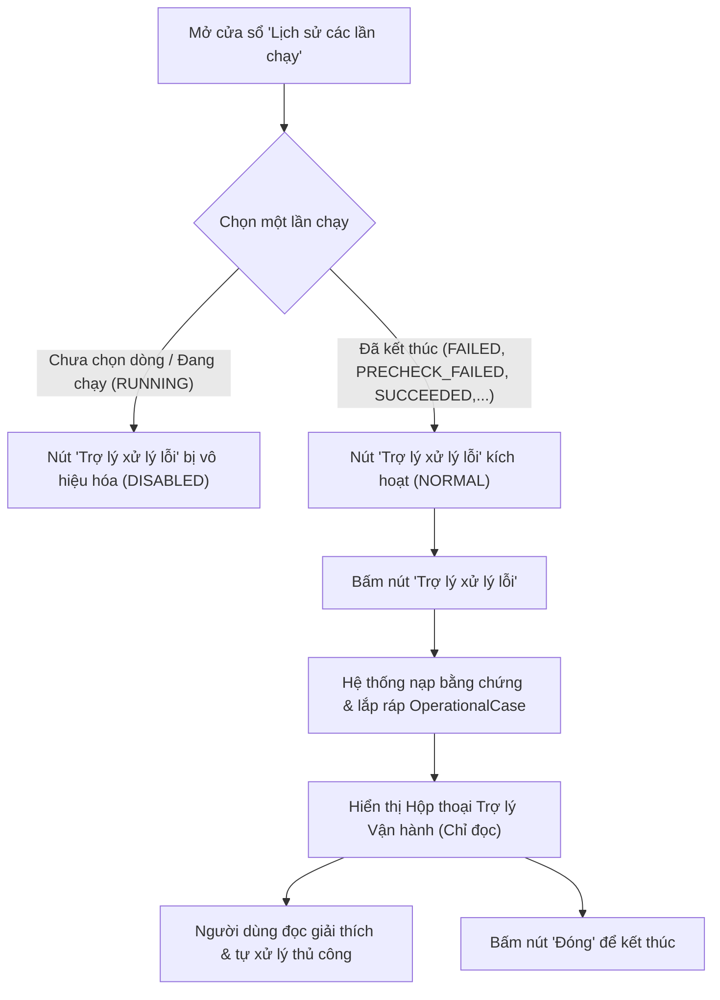

# Hướng dẫn Vận hành: Trợ lý Vận hành & Xử lý Lỗi (AI Operations Assistant)

> **Tài liệu kiểm soát**:
> - **Mã tính năng**: `002-ai-operations-assistant`
> - **Trạng thái**: Chờ nghiệm thu thủ công (Read-only MVP)
> - **Phiên bản**: `1.0.0`
> - **Ngày hiệu lực**: `2026-09-01`
> - **Tài liệu liên quan**: [`docs/operations/ai_operations_assistant_scope.md`](ai_operations_assistant_scope.md), [`specs/002-ai-operations-assistant/spec.md`](../../specs/002-ai-operations-assistant/spec.md)

---

## 1. Tổng quan & Mục đích (Overview)

Tính năng **Trợ lý Vận hành & Xử lý Lỗi** (AI Operations Assistant) là công cụ chẩn đoán cục bộ chỉ đọc (local-only, read-only). Trợ lý hỗ trợ người vận hành hệ thống MP2027 nhanh chóng hiểu nguyên nhân và các bước tự khắc phục thủ công khi một lần chạy gặp sự cố hoặc cần kiểm tra dữ liệu, dựa hoàn toàn trên bằng chứng thực tế từ nhật ký lần chạy.

---

## 2. Quy trình thao tác của người dùng (User Workflow)

1. **Bước 1**: Người dùng mở cửa sổ **Lịch sử các lần chạy** từ thanh điều khiển chính.
2. **Bước 2**: Trong bảng danh sách, chọn dòng bản ghi tương ứng với lần chạy cần hỗ trợ:
   - Nếu chưa chọn dòng hoặc chọn dòng đang chạy (`RUNNING`), nút **Trợ lý xử lý lỗi** ở trạng thái vô hiệu hóa (`DISABLED`).
   - Nếu chọn dòng có trạng thái kết thúc (`FAILED`, `PRECHECK_FAILED`, `SUCCEEDED`, `SUCCEEDED_INCOMPLETE`, `LEGACY_FY2027`), nút chuyển sang trạng thái sẵn sàng (`NORMAL`).
3. **Bước 3**: Bấm nút **Trợ lý xử lý lỗi**:
   - Hệ thống tự động đọc catalog và các tệp báo cáo bằng chứng của lần chạy tương ứng.
   - Hộp thoại Trợ lý Vận hành mở ra với đầy đủ thông tin giải thích, phạm vi, mức độ chắc chắn, danh sách bằng chứng và hướng dẫn việc cần làm.
   - Nếu người dùng bấm mở lại cùng lần chạy, cửa sổ hiện có sẽ tự động được nâng lên trước và nhận tiêu điểm (Singleton Guard).
4. **Bước 4**: Người dùng theo dõi các bước hướng dẫn an toàn và tự thực hiện điều chỉnh dữ liệu đầu vào hoặc thao tác thủ công.

---

## 3. Chính sách đa ngôn ngữ (Language Policy)

1. **Đồng bộ ngôn ngữ giao diện**: Trợ lý tự động sử dụng ngôn ngữ đang hoạt động của ứng dụng tại thời điểm mở:
   - **Tiếng Việt (`vi`)** (mặc định)
   - **Tiếng Anh (`en`)**
   - **Tiếng Nhật (`ja`)**
2. **Bản dịch viết tay chuẩn tắc (Deterministic Pre-authored Content)**:
   - 100% nội dung giải thích và hướng dẫn đều được biên soạn thủ công, có cấu trúc chặt chẽ và lưu trữ bất biến trong mã nguồn.
   - Tuyệt đối **không sử dụng dịch máy thời gian thực (no runtime machine translation)** để loại bỏ hoàn toàn nguy cơ sai lệch thuật ngữ kinh doanh.
3. **Nguyên tắc Fail-closed**:
   - Nếu ngôn ngữ yêu cầu nằm ngoài danh sách hỗ trợ hoặc ngôn ngữ của bản trình bày không khớp với giao diện, hệ thống từ chối mở và báo lỗi rõ ràng thay vì suy đoán sai.

---

## 4. Phân định Ngôn ngữ Nghiệp vụ & Chi tiết Kỹ thuật (Separation of Concerns)

Nhằm đảm bảo người dùng phổ thông không bị bối rối bởi các thuật ngữ lập trình chuyên sâu, giao diện được chia tách thành 2 vùng độc lập:

| Khu vực hiển thị | Mục đích | Ngôn từ sử dụng |
| :--- | :--- | :--- |
| **Vùng Hướng dẫn Chính (Primary Guidance)** | Giải thích hiện tượng, lý do và các bước cần thực hiện | Thuần túy ngôn ngữ nghiệp vụ vận hành; **cấm** đưa raw exception, traceback, JSON keys, hay tên hàm nội bộ vào khu vực này. |
| **Bảng Bằng chứng (Evidence Table)** | Liệt kê các tệp bằng chứng và trạng thái xác minh | Trình bày loại bằng chứng, vị trí và trạng thái rõ ràng (*Đã xác minh / Thiếu tệp / Không khớp*). |
| **Vùng Chi tiết Kỹ thuật (Technical Details)** | Dành cho quản trị viên hệ thống / kỹ sư hỗ trợ | Hiển thị mã tình huống, giai đoạn pipeline và đường dẫn kỹ thuật đã lưu trong case. **Tuyệt đối không tự ý đọc thêm tệp từ đĩa**. |

---

## 5. Ranh giới & Giới hạn Bằng chứng (Evidence Limits)

1. **Ranh giới thư mục nghiêm ngặt (Path Boundary Enforcement)**:
   - Trợ lý chỉ được phép đọc bằng chứng nằm trong đúng thư mục workspace `RUN_HISTORY/FY<năm>/<mã_lần_chạy>` của lần chạy được chọn.
   - Mọi hành vi cố gắng truy xuất đường dẫn tương đối vượt cấp (`../`) hoặc đường dẫn ngoài phạm vi lần chạy đều bị chặn đứng (`ValueError`).
2. **Các nguồn bằng chứng được công nhận**:
   - `run_manifest.json`: Thông tin cấu hình và thời gian thực thi.
   - `reports/preflight_report.json`: Kết quả tiền kiểm tra tính hợp lệ của nguồn đầu vào.
   - `reports/pipeline_stage_evidence.json`: Bằng chứng trạng thái của từng giai đoạn tính toán.
   - `reports/failure_traceback.txt`: Nhật ký lỗi kỹ thuật (chỉ dùng cho vùng kỹ thuật).
   - Bản ghi trong cơ sở dữ liệu `run_history.db`.
3. **Minh bạch trạng thái bằng chứng**:
   - `verified`: Tệp tồn tại, đúng định dạng và có mã băm toàn vẹn.
   - `missing`: Tệp báo cáo không tồn tại (được hiển thị rõ ràng, không bị ẩn đi).
   - `mismatch`: Tệp bị hỏng, sai cấu trúc JSON hoặc sai lệch năm tài chính.

---

## 6. Mức độ chắc chắn (Confidence Levels)

- **`confirmed` (Đã xác nhận)**:
  - Chỉ áp dụng khi có **đầy đủ 100% bằng chứng xác thực** khớp chính xác với một trong các quy tắc tri thức đã được phê duyệt.
- **`possible` (Có thể xảy ra)**:
  - Áp dụng khi có dấu hiệu phù hợp nhưng thiếu một phần bằng chứng hỗ trợ hoặc có cảnh báo phụ.
- **`unknown` (Chưa xác nhận)**:
  - Áp dụng cho mọi trường hợp còn lại: lỗi chưa từng gặp, bằng chứng bị thiếu/hỏng, hoặc có nhiều hơn một quy tắc cùng khớp (mơ hồ).
  - Trợ lý thông báo rõ ràng tình trạng *"Chưa xác nhận nguyên nhân cụ thể"*, liệt kê bằng chứng thô và hướng dẫn các bước kiểm tra tổng quát.

---

## 7. Ba lớp lỗi đã được phê duyệt (Supported Error Classes)

### 1. `missing_staffing_baseline` (Thiếu dữ liệu nhân sự mốc ban đầu)
- **Dấu hiệu bằng chứng**: Giai đoạn `validate_staffing` ở trạng thái `FAIL` và thông báo lỗi ghi nhận thiếu số liệu cột *Tổng số người tháng* (tháng 03).
- **Ý nghĩa nghiệp vụ**: Chưa có dữ liệu nhân sự mốc chuẩn để thực hiện phân bổ chi phí nhân công.
- **Hướng dẫn xử lý**: Kiểm tra lại file Excel nhân sự hoặc thiết lập ghi đè mốc nhân sự trong phần Cài đặt.

### 2. `blocked_output_file_lock` (Tệp kết quả đầu ra đang bị khóa)
- **Dấu hiệu bằng chứng**: Giai đoạn `publication` ở trạng thái `FAIL` và nhật ký ghi nhận lỗi cấp quyền/tệp đang được mở (`PermissionError` / File Lock).
- **Ý nghĩa nghiệp vụ**: Tệp Excel đầu ra trong thư mục `OUTPUT` đang được mở bởi Microsoft Excel hoặc một chương trình khác.
- **Hướng dẫn xử lý**: Đóng toàn bộ các tệp Excel đầu ra đang mở và chạy lại tiến trình.

### 3. `preflight_source_validation_failure` (Kiểm tra dữ liệu nguồn thất bại)
- **Dấu hiệu bằng chứng**: Báo cáo `preflight_report.json` có `ok: false` và tồn tại ít nhất một sự cố mức độ nghiêm trọng `BLOCKING`.
- **Ý nghĩa nghiệp vụ**: File dữ liệu đầu vào được chọn bị thiếu sheet bắt buộc, sai năm tài chính hoặc sai cấu trúc cột.
- **Hướng dẫn xử lý**: Kiểm tra danh sách vấn đề chặn trong báo cáo tiền trạm và chỉnh sửa file nguồn tương ứng.

---

## 8. Luồng xử lý khi Lỗi chưa xác nhận (`unknown`)

Khi gặp trường hợp chưa xác nhận:
1. Tiêu đề hiển thị: *“Tình huống vận hành chưa xác định nguyên nhân cụ thể”*.
2. Độ tin cậy: Luôn mang nhãn *“Chưa xác nhận”* (màu cảnh báo), tuyệt đối không hiển thị Đã xác nhận.
3. Hướng dẫn an toàn:
   - Kiểm tra nhật ký lần chạy chi tiết trong thư mục `reports`.
   - Đối chiếu danh sách tệp nguồn đầu vào.
   - Liên hệ đội ngũ phát triển hệ thống nếu sự cố tiếp tục tái diễn.

---

## 9. Giới hạn & Các điều cấm tuyệt đối (Explicit Non-Capabilities)

Trợ lý Vận hành được thiết kế theo mô hình **Zero-Mutation (Không biến đổi)**:
- ❌ **CẤM TỰ ĐỘNG SỬA FILE**: Không có tính năng tự sửa file Excel, CSV, hay Database.
- ❌ **CẤM TỰ ĐỘNG CHẠY LẠI**: Không tự ý kích hoạt pipeline tính toán.
- ❌ **CẤM KẾT NỐI AI / MẠNG NGOÀI**: Không gửi bất kỳ dữ liệu nào qua mạng, không yêu cầu API key.
- ❌ **CẤM QUẢN LÝ KHÓA KÝ SỐ**: Tuân thủ chính sách `HASH_ONLY_LAN`.
- ❌ **CẤM GHI ĐÈ BẰNG CHỨNG CŨ**: Toàn bộ dữ liệu `RUN_HISTORY` là append-only và chỉ đọc.

---

## 10. Nghiệm thu thủ công (T027 — chưa thực hiện)

T022–T026 được xác minh bằng fixture CI-safe và fake widget. Các kiểm tra đó **không phải** là nghiệm thu do con người thực hiện.

Trước khi đánh dấu T027 hoàn tất, người chịu trách nhiệm cần thực hiện và ghi lại hai ca sau bằng dữ liệu thử nghiệm cục bộ, không đưa log hay dữ liệu công ty vào Git:

1. Một lần chạy có lỗi đã xác nhận, ví dụ `missing_staffing_baseline`: xác nhận ngôn ngữ, phạm vi FY/Cost Center, bằng chứng và hướng dẫn an toàn đều dễ hiểu.
2. Một lần chạy có lỗi chưa xác nhận: xác nhận màn hình nói rõ nguyên nhân chưa được xác nhận và không gợi ý hay cung cấp thao tác sửa/tự chạy lại.

Biên bản cần ghi ngày thực hiện, người nghiệm thu, hai kết quả quan sát được và mọi hướng dẫn bị từ chối. Chỉ sau đó mới đổi trạng thái tài liệu và đánh dấu T027.

---

## 11. Tư vấn AI nội bộ C-AGENT (Phase 6)

### Nguyên tắc vận hành
- C-AGENT là dịch vụ nội bộ do IT doanh nghiệp quản lý.
- Mặc định ở trạng thái bị vô hiệu hóa (`enabled=False`) cho đến khi có cấu hình triển khai hợp lệ.
- Dữ liệu gửi đi chỉ thuộc duy nhất lần chạy đã chọn (`selected run`): tóm tắt sự cố, mã lỗi, trích đoạn báo cáo và đường dẫn trong workspace của lần chạy đó.
- Không gửi thông tin xác thực, token, biến môi trường, dữ liệu ngoài workspace hay dữ liệu của các lần chạy khác.
- Phản hồi từ C-AGENT chỉ mang tính chất tham khảo (advisory only). Hệ thống không tự ý sửa đổi file hay chạy lại pipeline.
- Nghiệm thu thực tế trên mạng nội bộ doanh nghiệp đang chờ hoàn tất bàn giao IT ở Task T028 và nghiệm thu ở Task T042.
