# Current Source Authority Notice

Current canonical requirement: `raw/Cải tiến nhập dữ liệu chung vào file MPnew 10.07.2026.xlsx`. The user confirmed it as the newest requirement source on `2026-07-11`.
No visual snapshot has been confirmed for the 10.07 workbook. Any 09.06 visual snapshot, audit, or derived Markdown is historical evidence only and must not override the 10.07 workbook.
If there is any conflict, the canonical workbook wins over the visual snapshot, Markdown, audit history, and derived descriptions. Refresh/verify any requirement details from 10.07.2026 before using this document for new decisions.

Current source hierarchy:

- `CANONICAL_SOURCE_USER_CONFIRMED_AT=2026-07-11`
- Canonical requirement date: `10.07.2026`.
- Implementation status was last verified against the prior 09.06 source and therefore requires a current audit before being claimed against 10.07.
- Historical content, including `HISTORICAL_04_06_CONTEXT`, must not override current audits, code, or the canonical 10.07.2026 workbook.

# Cải tiến nhập dữ liệu chung vào file MPnew.xlsx — bản kế hoạch đã kiểm tra, sửa và bổ sung

## 0.0. Historical reconcile of the 09.06 workbook

Ngày reconcile local: `2026-07-07 06:39:28` (historical; current canonical is 10.07.2026).

Đã đọc lại workbook 09.06.2026 sau khi người dùng báo file đã bổ sung nội dung. Snapshot trích xuất đầy đủ được lưu ngoài repo tại artifact scratch để audit nội bộ agent, không commit vào project. Section này không xác minh nội dung mới của workbook canonical 10.07.2026.

### 0.0.1. Inventory workbook hiện tại

| Sheet | Max row | Max column | Ghi chú nghiệp vụ |
|---|---:|---:|---|
| `Sheet1` | 55 | 2 | Tổng quan nhóm yêu cầu và mô tả cải tiến. |
| `Hạng mục cần cải tiến` | 233 | 11 | Danh sách hạng mục, thứ tự ưu tiên và liên kết tới sheet chi tiết. |
| `Chi phí hệ thống` | 97 | 9 | Rule system cost, gộp/ghi công thức theo chi phí hệ thống. |
| `Chi phí khấu hao, lãi nhà đất` | 131 | 17 | Rule facility: khấu hao/lãi nhà đất, điện, nước. |
| `Chi phí tài sản cố định` | 66 | 21 | Rule fixed assets, khấu hao/lãi theo tài sản/tháng. |
| `Chi phí làm giấy tờ cho NNN` | 24 | 17 | Rule NNN paperwork, target row/range cần giữ theo canonical. |
| `Chi phí sinh nhật` | 48 | 16 | Rule birthday: số người/người mới x đơn giá. |
| `Chi phí phân bổ từ hành chính ` | 215 | 20 | Rule admin/GA allocation, headcount previous-month, bus scalar, event-month allocation. |
| `勘定科目` | 244 | 9 | Master account; cột `製造`/`一般`/`販売` để lấy account code theo `原価区分`. |
| `原価センタ` | 66 | 5 | Master Cost Center; dùng `原価区分`, không dùng nhầm `採算区分`, khi chọn account group. |

### 0.0.2. Nội dung bổ sung/nhấn mạnh cần phản ánh khi code hoặc audit

- Sheet `Chi phí phân bổ từ hành chính ` hiện ghi rõ nhóm chi phí 12 tháng:
  - Áp dụng cho gas, nước rửa tay, giấy vệ sinh, cleaning.
  - Công thức: `số người * chi phí tương ứng`.
  - Driver headcount là tổng số người của tháng trước.
  - Ngoại lệ tháng 4/2026: do không có dữ liệu tháng 3 kỳ trước, dùng tổng số người tháng 4/2026.
- Cùng sheet này ghi riêng bus đưa đón người biệt phái (người Nhật)/người Việt:
  - Công thức: `số người nhập ở đầu phần mềm * chi phí tương ứng`.
  - Bus count là scalar input theo CC, độc lập với staff/worker/male/female headcount.
  - Excel gốc dùng: "Người biệt phái đi xe bus" (= người Nhật được cử sang) và "Người VN đi xe bus".
- Rule lấy account code vẫn bắt buộc đi qua chuỗi:
  - `Cost Center -> 原価センタ -> 原価区分 -> 勘定科目 -> cột 製造/一般/販売 -> account_code`.
  - Không dùng nhầm `採算区分` để chọn cột account.
- Các sheet master `勘定科目` và `原価センタ` là dữ liệu canonical trong workbook requirement hiện tại; Markdown chỉ diễn giải.
- Khi có khác biệt giữa phần dưới đây và workbook Excel hiện tại, workbook Excel vẫn thắng.

---

> Tài liệu này được viết lại từ file phân tích `cai_tien_nhap_du_lieu_chung.md` do Gemini Flash tạo, dựa trên đối chiếu với file yêu cầu gốc **`Cải tiến nhập dữ liệu chung vào file MPnew.xlsx`**.
> Bản canonical hiện tại: **`Cải tiến nhập dữ liệu chung vào file MPnew 10.07.2026.xlsx`**. Bản **`Cải tiến nhập dữ liệu chung vào file MPnew 04.06.2026.xlsx`** và nội dung reconcile 09.06 bên dưới chỉ là historical context; mọi quyết định mới phải verify lại với canonical 10.07.2026.
> Nguyên tắc chỉnh sửa: **giữ phần Gemini cào đúng**, **sửa phần sai/nguy hiểm**, **bổ sung phần thiếu để agent có thể dùng làm kế hoạch viết chương trình**.
> Không coi đây là bản “raw dump cell”; đây là **đặc tả nghiệp vụ + kế hoạch triển khai + tiêu chí kiểm thử** cho chương trình **PhanmemsaisanMP / MP2027 Manager**.

---

## 0. Kết luận rà soát bản Gemini cào dữ liệu

Bản Gemini cào dữ liệu **không sai hoàn toàn**, nhưng **không khớp 100% với ý nghĩa nghiệp vụ của file gốc** nếu dùng trực tiếp làm kế hoạch code.

### 0.1. Phần Gemini đã làm đúng và được giữ

Gemini đã lấy được nhiều text quan trọng nằm trực tiếp trong workbook:

- Danh sách 10 sheet trong file yêu cầu:
  - `Sheet1`
  - `Hạng mục cần cải tiến`
  - `Chi phí hệ thống`
  - `Chi phí khấu hao, lãi nhà đất`
  - `Chi phí tài sản cố định`
  - `Chi phí làm giấy tờ cho NNN`
  - `Chi phí sinh nhật`
  - `Chi phí phân bổ từ hành chính `
  - `勘定科目`
  - `原価センタ`
- Các yêu cầu tổng quát:
  - Không cần điền 2 dữ liệu nhân sự cũ.
  - Đẩy dữ liệu về đúng cột FORM.
  - Bôi lại đúng màu/định dạng FORM vốn có.
  - Để lại tất cả công thức tính.
  - Sửa sai code chi phí hệ thống.
  - Đổi UI nhập số người theo logic mới.
  - Bổ sung hạng mục trong sheet `Chi phí phân bổ từ hành chính`.
  - Bổ sung chi phí làm giấy tờ cho người nước ngoài.
- Các công thức nghiệp vụ quan trọng:
  - Chi phí hệ thống: `ROUND((tổng chi phí USD chi tiết) * tỷ giá USD ô B2, 0)`.
  - Facility: khấu hao/lãi nhà đất nhân tỷ giá USD.
  - Fixed assets: xử lý theo tháng khấu hao cuối cùng.
  - Birthday: `số người * đơn giá`.
  - Administrative allocation: `số người * đơn giá`.
  - Người mới: bổ sung phân tách sổ nhân viên/công nhân và khám sức khỏe tuyển dụng phân bổ tháng sau.
- Các vùng dòng/cột FORM được nêu trong yêu cầu:
  - NNN paperwork: dòng 137, `F137:Q137`.
  - Birthday: có xung đột dòng 63 và dòng 59, cần ưu tiên xử lý như mục 7.4.
  - Fixed asset depreciation: dòng 38, `F38:Q38`.
  - Fixed asset interest: dòng 42, `F42:Q42`.
  - New employee notebook staff: dòng 97.
  - New employee notebook worker: dòng 98.
  - Hiring medical check: dòng 58.

### 0.2. Những điểm Gemini cào chưa đủ hoặc dễ gây sai khi code

Các điểm dưới đây phải được sửa trong kế hoạch để tránh agent viết sai chương trình:

1. **Nhầm/không phân biệt rõ Cost Center và Account Code**
   Các mã như `1412000006`, `1412000018`, `1412000089` là **Cost Center / 原価センタ / code phòng chịu chi phí**, không phải mã tài khoản kế toán.
   Mã tài khoản kế toán là các mã dạng `500...`, `600...`, `700...`, `911...`.

2. **Cụm “code tài khoản chịu chi phí” trong file yêu cầu có thể là cách người dùng gọi chưa chuẩn**
   Trong một số sheet như `Chi phí làm giấy tờ cho NNN` và `Chi phí sinh nhật`, text ghi “Filter code tài khoản mong muốn tại cột Code tài khoản chịu chi phí”, nhưng ví dụ lại dùng `1412000018`. Vì vậy agent phải hiểu theo nghiệp vụ là **filter theo Cost Center chịu chi phí**, không được filter nhầm sang account code.

3. **Rule tra account theo nhóm 製造 / 一般 / 販売 chưa được Gemini diễn giải đủ**
   Phải dùng:
   - Sheet `原価センタ`: lấy Cost Center → xác định `原価区分`.
   - Sheet `勘定科目`: lấy `JP_Name` / tên tài khoản → lấy mã account ở cột tương ứng:
     - Cột `製造`
     - Cột `一般`
     - Cột `販売`

   Lưu ý quan trọng: **khi chọn mã account theo nhóm, ưu tiên dùng `原価区分`, không dùng nhầm `採算区分`**.
   Ví dụ Cost Center `1412000072` có `採算区分 = 部内間接` nhưng `原価区分 = 販売`; khi cần lấy account theo nhóm thì phải chọn nhóm `販売`.

4. **Gemini chỉ cào text, chưa chuyển thành rule code/test**
   File gốc chứa nhiều screenshot, mũi tên, vùng khoanh đỏ, màu xám/màu đỏ. Các thông tin này cần chuyển thành quy tắc:
   - FORM output phải giữ định dạng.
   - Không paste số chết nếu yêu cầu để công thức.
   - Có audit trace nguồn dữ liệu.
   - Có test đối chiếu dòng/cột, công thức, account code.

5. **Có xung đột trong yêu cầu dòng FORM**
   Ví dụ `Chi phí sinh nhật` vừa có “Nhập vào dòng 63 (G63:Q63)” vừa có “Nhập vào dòng 59, F59:Q59”. Cần ghi rõ đây là **điểm xung đột** và đề xuất cách xử lý an toàn.

6. **HISTORICAL_04_06_CONTEXT — Cụm “6 chi phí / gộp thành 1 dòng chi phí” được ghi nhận trong lineage 04.06 và phải đối chiếu lại với canonical 10.07.2026**
   `Hạng mục cần cải tiến!H182` (“6 chi phí”) link tới `Chi phí khấu hao, lãi nhà đất!J65`, nghĩa là Facility có 6 khoản theo thứ tự. `Hạng mục cần cải tiến!K186` (“gộp thành 1 dòng chi phí”) link tới `Chi phí hệ thống!A89`, nghĩa là System Cost phải gộp thành 1 dòng duy nhất. Không được hiểu “6 chi phí” là gộp Facility thành 1 dòng.

---

## 0.3. HISTORICAL_04_06_CONTEXT — lineage từ MPnew 04.06.2026, chỉ giữ nơi không mâu thuẫn với canonical 10.07.2026

| Nguồn xác nhận | Nội dung mới | Ảnh hưởng triển khai |
|---|---|---|
| Historical predecessor | `Cải tiến nhập dữ liệu chung vào file MPnew 04.06.2026.xlsx` | Chỉ dùng để giải thích lineage thay đổi; canonical hiện tại là `Cải tiến nhập dữ liệu chung vào file MPnew 10.07.2026.xlsx`. |
| `Hạng mục cần cải tiến!A179:B180` | Điền dữ liệu theo thứ tự file; thứ tự chi phí chi tiết xem sheet tương ứng | Với nhóm không có row cố định rõ, output theo thứ tự file và sau mỗi file nguồn chừa 1 dòng trống. |
| `Hạng mục cần cải tiến!H182` → `Chi phí khấu hao, lãi nhà đất!J65` | “6 chi phí” | Facility có 6 khoản theo thứ tự: khấu hao nhà, khấu hao đất, lãi nhà, lãi đất, điện, nước. Không gộp Facility thành 1 dòng. |
| `Hạng mục cần cải tiến!K186` → `Chi phí hệ thống!A89` | “gộp thành 1 dòng chi phí” / “Nhập vào 1 dòng duy nhất” | System Cost phải gộp thành 1 dòng; không còn hardcode row 75 theo requirement mới. |
| User confirmation | `社員旅行不参加対象者へのギフト贈呈` không bắt buộc row cố định | Có thể xử lý theo thứ tự file; không dùng row 66; chỉ thêm row test-lock nếu sau này có row cố định được xác nhận. |

Không có dòng nào trong mục này được hiểu là canonical/current nếu mâu thuẫn với Source Notice hoặc workbook 10.07.2026.

---

## 1. Mục tiêu tổng thể của yêu cầu

Người dùng muốn cải tiến chương trình để tự động nhập dữ liệu chi phí chung từ nhiều file Excel nguồn vào file Master Plan / FORM.

Luồng nghiệp vụ mong muốn:

```text
1. Người dùng chọn hoặc chương trình xác định Cost Center / code phòng chịu chi phí.
2. Chương trình đọc các file chi phí chung được cung cấp.
3. Chương trình filter dữ liệu theo Cost Center chịu chi phí.
4. Chương trình xác định đúng account code, tên account, nội dung, ghi chú, tháng phân bổ.
5. Chương trình điền dữ liệu vào FORM đúng dòng, đúng cột tháng.
6. Những khoản có công thức phải để lại công thức, không paste số chết.
7. Output phải giữ màu, font, border, number format, layout, filter giống FORM vốn có.
8. Có kiểm tra/audit để biết dòng nào lấy từ file nào, sheet nào, rule nào.
```

### 1.1. Mục tiêu không phải chỉ là copy/paste

Yêu cầu này không đơn giản là copy dữ liệu từ Excel nguồn sang FORM.
Nó cần một **engine mapping nghiệp vụ** giữa:

- Cost Center / 原価センタ
- Department name / tên phòng
- Account Code / 勘定科目
- Account name / JP_Name
- Group `製造 / 一般 / 販売`
- Expense content / 内容
- Allocation month / 月
- Driver / số người / số user / số ID / số nhân viên mới
- Unit price
- FX rate
- FORM target row
- FORM target month columns `F:Q`

---

## 2. Danh sách sheet trong file yêu cầu gốc

| STT | Sheet | Vai trò |
|---:|---|---|
| 1 | `Sheet1` | Tổng quan yêu cầu, danh sách nhóm file chi phí chung, hình dung cách làm. |
| 2 | `Hạng mục cần cải tiến` | Danh sách các vấn đề cần sửa, thứ tự ưu tiên, ghi chú mới ngày 9/4. |
| 3 | `Chi phí hệ thống` | Quy tắc tính chi phí hệ thống từ nhiều sheet chi tiết, phải nhập công thức vào 1 dòng. |
| 4 | `Chi phí khấu hao, lãi nhà đất` | Quy tắc chi phí facility: khấu hao nhà/đất, lãi nhà/đất, điện, nước. |
| 5 | `Chi phí tài sản cố định` | Quy tắc fixed assets theo asset, tháng khấu hao cuối cùng, khấu hao và lãi. |
| 6 | `Chi phí làm giấy tờ cho NNN` | Chi phí làm giấy tờ cho người nước ngoài, nhập dòng 137. |
| 7 | `Chi phí sinh nhật` | Chi phí sinh nhật theo số người + người mới, đơn giá từ file phân bổ. |
| 8 | `Chi phí phân bổ từ hành chính ` | Nhóm chi phí phức tạp nhất: chi phí 12 tháng, event theo tháng, người mới, khám sức khỏe. |
| 9 | `勘定科目` | Master account; dùng để tra account code theo `製造 / 一般 / 販売`. |
| 10 | `原価センタ` | Master Cost Center; dùng để tra nhóm chi phí theo `原価区分`. |

---

## 3. Thuật ngữ bắt buộc dùng đúng khi viết code

### 3.1. Cost Center / 原価センタ / code phòng chịu chi phí

Ví dụ:

```text
1412000006
1412000018
1412000089
1412000024
1412000030
```

Đây là mã phòng/bộ phận chịu chi phí.
Không được gọi là account code trong code nội bộ.

Đề xuất đặt tên biến:

```python
cost_center
cost_center_code
department_cost_center
```

Không dùng tên mơ hồ:

```python
account_code  # sai nếu giá trị là 1412...
```

### 3.2. Account Code / 勘定科目

Ví dụ:

```text
5005246282
6005146628
6005146542
5004086291
6004086651
9114120028
```

Đây là mã tài khoản kế toán.
Dùng để tìm dòng tương ứng trong FORM.

Đề xuất đặt tên biến:

```python
account_code
account_jp_name
profit_item
```

### 3.3. `採算区分` và `原価区分`

Trong sheet `原価センタ` có 2 cột dễ nhầm:

| Cột | Ý nghĩa | Cách dùng trong yêu cầu |
|---|---|---|
| `採算区分` | Phân loại採算/indirect như 製造, 部内間接, 部外間接1, 部外間接2, 工場間接 | Có thể dùng cho phân tích nội bộ nhưng **không dùng làm group account chính**. |
| `原価区分` | Nhóm chi phí cuối cùng: 製造 / 一般 / 販売 | **Dùng để chọn cột account trong sheet 勘定科目**. |

Rule bắt buộc:

```text
Cost Center -> 原価センタ -> 原価区分 -> chọn cột 製造/一般/販売 trong 勘定科目.
```

---

## 4. Yêu cầu chung trên toàn bộ output FORM

### 4.1. Không cần điền 2 dữ liệu nhân sự cũ

Sheet `Hạng mục cần cải tiến` ghi: **Không cần điền 2 dữ liệu dưới vào file**.

Từ ảnh/sheet gốc, 2 dữ liệu này là nhóm nhân sự cũ kiểu:

- `出向社員（人）`
- `ローカル社員（人）`

Yêu cầu code:

- Không tự động sinh/điền 2 dòng này vào output nếu chúng là dòng cũ không cần thiết.
- Nếu template FORM vẫn có sẵn dòng này, không được xóa bừa layout; chỉ bỏ qua việc nhập dữ liệu nếu chưa có chỉ thị xóa dòng.
- Cần test regression để đảm bảo output không phát sinh lại 2 dòng dữ liệu cũ từ engine.

Hình minh họa từ Excel gốc (item 1 — không cần điền 2 dữ liệu):

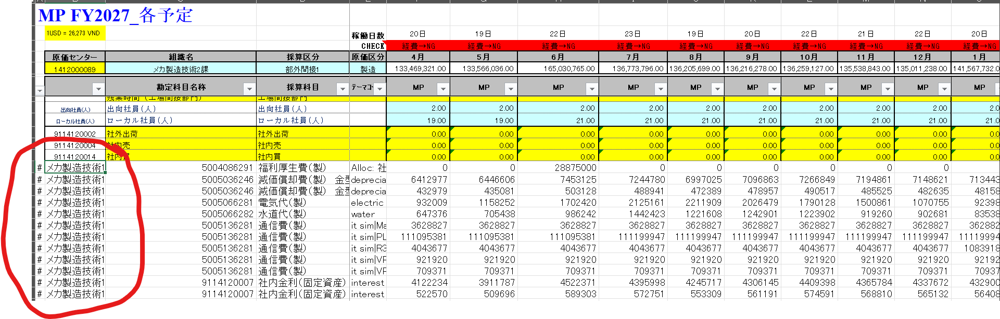

### 4.2. Đẩy dữ liệu về đúng cột theo FORM

Sheet `Hạng mục cần cải tiến` yêu cầu: **Đẩy các cột dữ liệu ghi dưới về cột chỉ mũi tên ghi dưới**.

Agent phải đảm bảo các cột output khớp FORM gốc, đặc biệt:

- Tên tổ chức/phòng.
- Account code.
- Account name.
- 採算科目 / hạng mục lợi nhuận nếu FORM có.
- Theme code nếu FORM có.
- Ghi chú / 備考.
- WBS nếu FORM có.
- 12 cột tháng của FY2027:
  - Tháng 4/2026
  - Tháng 5/2026
  - Tháng 6/2026
  - Tháng 7/2026
  - Tháng 8/2026
  - Tháng 9/2026
  - Tháng 10/2026
  - Tháng 11/2026
  - Tháng 12/2026
  - Tháng 1/2027
  - Tháng 2/2027
  - Tháng 3/2027

Không được tự tạo layout output mới nếu yêu cầu là nhập vào FORM gốc.

Hình minh họa từ Excel gốc (item 2 — đẩy cột về đúng vị trí):

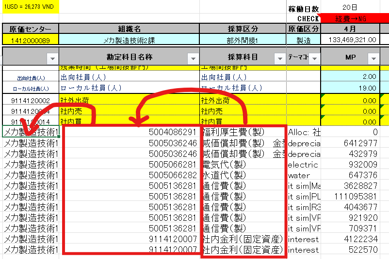

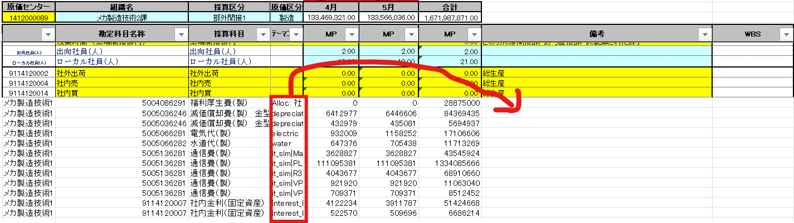

### 4.3. Giữ màu và định dạng FORM gốc

Yêu cầu: **Bôi lại đúng màu, đúng định dạng như FORM vốn có**.

Khi ghi dữ liệu vào output:

- Giữ font.
- Giữ fill color.
- Giữ border.
- Giữ merged cells nếu có.
- Giữ number format.
- Giữ row height/column width.
- Giữ filter/header nếu FORM có.
- Không làm mất công thức/cell style ở các vùng không liên quan.

Cách triển khai an toàn:

```text
1. Luôn copy từ template FORM.xlsx.
2. Chỉ ghi vào các ô đích cần ghi.
3. Khi cần thêm dòng mới, copy nguyên style từ dòng mẫu gần nhất cùng loại account.
4. Không rebuild workbook từ đầu bằng DataFrame trắng.
```

Hình minh họa từ Excel gốc (item 3 — bôi lại đúng màu):

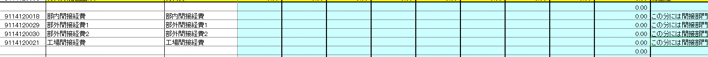

### 4.4. Để lại tất cả công thức tính

Yêu cầu: **Để lại tất cả các công thức tính**.

Điều này là bắt buộc với các nhóm:

- Chi phí hệ thống.
- Chi phí khấu hao/lãi nhà đất.
- Chi phí tài sản cố định.
- Chi phí sinh nhật.
- Chi phí phân bổ hành chính.
- Chi phí người mới.

Không được chỉ ghi kết quả số nếu file yêu cầu công thức.

Ví dụ đúng:

```excel
=ROUND((11*3.19+12*11.51+1*153.91+2*2114.25+12*2.25)*$B$2,0)
```

Ví dụ sai:

```text
120399175
```

Ngoại lệ:

- Nếu nguồn yêu cầu “copy/paste dữ liệu” và không yêu cầu để công thức, có thể ghi giá trị, nhưng vẫn nên có audit trace.
- Nếu công thức quá dài hoặc FORM không cho phép, phải ghi giá trị + ghi công thức nguồn vào audit sheet, nhưng đây là fallback, không phải mặc định.

Hình minh họa từ Excel gốc (item 4 — để lại công thức):

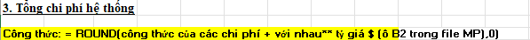

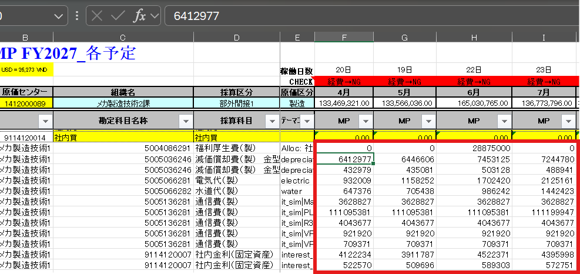

### 4.5. Audit bắt buộc

Mỗi khoản được ghi vào FORM nên có record audit tối thiểu:

| Trường | Ý nghĩa |
|---|---|
| `cost_center` | Cost Center đang xử lý. |
| `target_sheet` | Sheet FORM đích. |
| `target_cell_or_range` | Ô/vùng đã ghi. |
| `source_file` | File nguồn. |
| `source_sheet` | Sheet nguồn. |
| `source_filter` | Điều kiện filter. |
| `account_code` | Account code cuối cùng. |
| `account_jp_name` | JP_Name dùng để tra. |
| `driver` | Số người/số user/số ID/số nhân viên mới. |
| `unit_price` | Đơn giá nếu có. |
| `formula` | Công thức ghi vào FORM nếu có. |
| `value` | Kết quả tính nếu có thể tính. |
| `status` | OK / WARN / MISSING_INPUT / CONFLICT. |
| `note` | Ghi chú khác. |

---

## 5. Sheet `Sheet1` — tổng quan yêu cầu

Hình tổng quan file MP từ Sheet1:

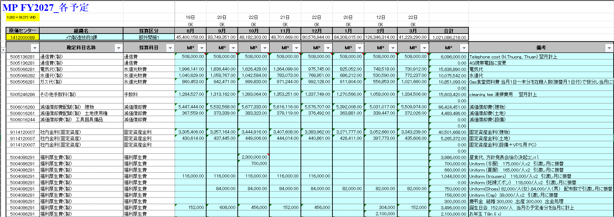

Danh sách file chi phí chung (từ Sheet1):


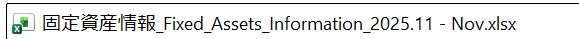


### 5.1. Nội dung Gemini cào đúng

Sheet này ghi mục tiêu chính:

```text
Cải tiến nhập tự động dữ liệu chung từ các file được cung cấp sẵn vào file Master Plan
```

Các nhóm file chi phí chung:

- Chi phí hệ thống.
- Chi phí khấu hao, lãi nhà đất, điện nước.
- Chi phí tài sản cố định.
- Chi phí phân bổ từ hành chính.

### 5.2. Cách làm tổng quát

File mô tả:

```text
① Filter "code phòng chịu chi phí" trong các file chi phí chung.
② Filter "code tài khoản chịu chi phí", "tên tài khoản chịu chi phí", "ghi chú" trong file MP đối tượng.
③ Nhập dữ liệu từ mục ① vào ② theo công thức hoặc paste nguyên số.
```

Diễn giải đúng cho code:

```text
Input:
- Cost Center / code phòng.
- FORM template.
- Các file nguồn chi phí chung.
- Master account và cost center.

Process:
- Lọc nguồn theo Cost Center.
- Xác định account đích trong FORM.
- Xác định tháng đích.
- Ghi công thức hoặc giá trị theo từng loại chi phí.

Output:
- File MP/FORM đã nhập dữ liệu.
- Audit report.
```

---

## 6. Sheet `Hạng mục cần cải tiến` — danh sách cải tiến chung

### 6.1. Các mục cải tiến ban đầu

1. Không cần điền 2 dữ liệu nhân sự cũ vào file.
2. Đẩy dữ liệu về đúng cột chỉ mũi tên.
3. Bôi lại đúng màu/định dạng như FORM vốn có.
4. Để lại tất cả công thức tính.
5. Sửa sai code chi phí hệ thống.
6. Sửa UI nhập số người:
   - Nhập đồng thời số người 12 tháng.
   - Riêng tháng 12 phải hiển thị nhập số lượng Nam/Nữ để tính khám sức khỏe.
   - Label tháng phải hiển thị `Tháng 4`, `Tháng 5`, ... thay vì `202704`, `202705`, ...
7. Bổ sung hạng mục ở sheet `Chi phí phân bổ từ hành chính`.

Hình minh họa từ Excel gốc (item 5 — sai code hệ thống):

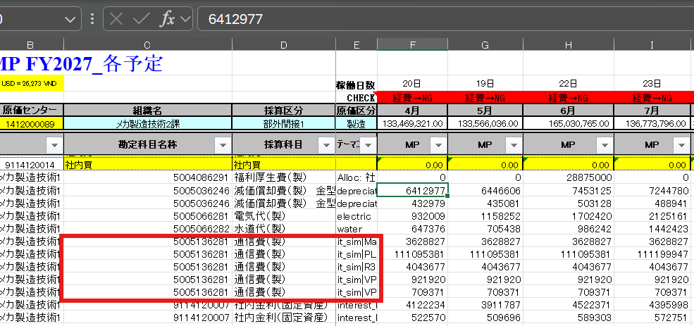

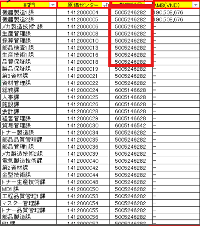

### 6.2. Ghi chú màu trong file yêu cầu

File ghi:

```text
Những dòng, sheet bôi màu xám là đã được thực hiện.
Sheet không bôi màu là sheet vẫn chưa được thực hiện.
Sheet màu đỏ là nội dung mới.
```

Ý nghĩa cho agent:

- Không dùng màu chỉ để hiển thị; màu là trạng thái yêu cầu.
- Khi đọc workbook, nếu có khả năng truy xuất cell fill, có thể dùng màu để phân loại:
  - Xám: đã làm/đã có.
  - Không màu: chưa làm.
  - Đỏ: nội dung mới.
- Nếu không đọc được màu, phải dựa trên text đã cào và ảnh/screenshot để xác định scope.

### 6.3. Ghi chú ngày 9/4 — ưu tiên mới

Ngày 9/4 người dùng bổ sung:

1. **Chi phí hệ thống chưa lấy được công thức, vẫn là dạng số**
   - Công thức tính bị sai.
   - Tổng tiền không khớp với số đúng IT liên lạc.
   - Số tiền ở bản ghi trên thì đúng.
   - Cần dùng công thức:
     ```excel
     =ROUND((công thức các chi phí chi tiết cộng lại) * tỷ giá USD ô B2 trong file MP, 0)
     ```
2. **Sửa lại đối tượng áp dụng và công thức tính tiền phân bổ từ hành chính**
3. **Bổ sung hạng mục mới trong phân bổ hành chính**
4. **Bổ sung chi phí mới: chi phí làm giấy tờ cho người nước ngoài**
5. **Ưu tiên làm trước**
   - Làm `Chi phí phân bổ từ hành chính`.
   - Làm `Chi phí làm giấy tờ cho người nước ngoài`.
   - `Chi phí tài sản cố định` khó hơn, có thể làm sau.

Hình minh họa ghi chú ngày 9/4 (bug công thức hệ thống, tổng tiền sai):

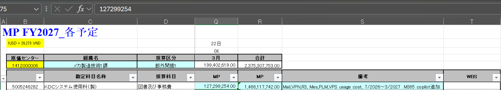

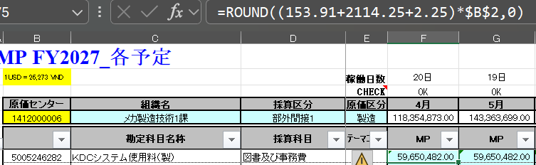

### 6.4. Input số người mới thay thế logic hiện tại

File yêu cầu:

```text
Thay vì nhập số người của 12 tháng như hiện tại thì sẽ nhập những dữ liệu ghi dưới.
```

Danh sách input mới cần hỗ trợ:

| Input | Cách dùng |
|---|---|
| Số người JP dùng xe bus | Dùng chung cho 12 tháng. |
| Số người VN dùng xe bus | Dùng chung cho 12 tháng. |
| Tháng 3 FY cũ — tiền triết lý | Dùng cho khoản liên quan philosophy/My Episode nếu rule cần tháng trước FY. |
| Tháng 4 — tiệc sau phát biểu phương châm bộ phận | Driver riêng. |
| Tháng 5 — du lịch | Driver riêng. |
| Tháng 6 — người không đi du lịch được nhận quà | Driver riêng. |
| Tháng 10 — quà kỷ niệm 10 năm | Driver riêng. |
| Tháng 10 — tiệc kỷ niệm 10 năm gắn bó | Driver riêng. |
| Tháng 12 — Nam | Driver cho khám sức khỏe nam. |
| Tháng 12 — Nữ | Driver cho khám sức khỏe nữ. |

Yêu cầu UI:

- Không hiển thị label kiểu `202704`, `202705`.
- Hiển thị thân thiện:
  - `Tháng 4`
  - `Tháng 5`
  - ...
  - `Tháng 12 - Nam`
  - `Tháng 12 - Nữ`

Hình minh họa (nhập số người 12 tháng, tách Nam/Nữ ở tháng 12):

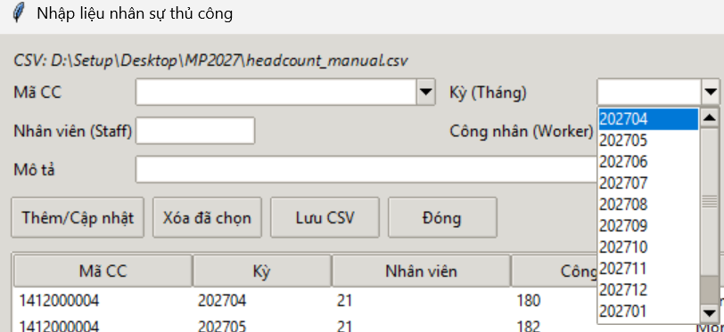

### 6.5. “Xóa nội dung dưới đây cho không cần thiết”

Trong sheet có ghi “Xóa nội dung dưới đây cho ko cần thiết”.
Agent phải kiểm tra hình/FORM để biết chính xác vùng nào cần bỏ. Nếu chưa xác định được vùng cụ thể:

- Không tự ý xóa logic rộng.
- Chỉ mark là `DEPRECATED_INPUT_BLOCK`.
- Ẩn/không dùng input cũ nếu đã thay bằng input mới.
- Không xóa dữ liệu nguồn/audit.

Hình minh họa (xóa nội dung không cần thiết):


### 6.6. HISTORICAL_04_06_CONTEXT — lineage 04.06 cho thứ tự file và dòng trống giữa các nhóm file

ChatGPT đã audit trực tiếp 2 workbook requirement tại thời điểm 04.06 và ghi nhận bản 04.06 như historical predecessor.
Canonical hiện tại là `Cải tiến nhập dữ liệu chung vào file MPnew 10.07.2026.xlsx`; các rule dưới đây chỉ được giữ nếu không mâu thuẫn với canonical 10.07.
Trong sheet `Hạng mục cần cải tiến`, bản mới thêm:

```text
A179 = Điền dữ liệu theo thứ tự dưới đây:
B180 = Ngoài ra, thứ tự các chi phí của từng file thì ghi trong từng sheet bên cạnh
H182 = 6 chi phí
K186 = gộp thành 1 dòng chi phí
```

Quy tắc output theo xác nhận của user:

- Với nhóm chi phí không có row cố định rõ trong FORM, output được phép chạy theo thứ tự file trong sheet `Hạng mục cần cải tiến`.
- Sau khi xử lý xong 1 file nguồn, chừa 1 dòng trống trước nhóm file tiếp theo.
- Thứ tự chi phí chi tiết trong từng file xem trong sheet tương ứng bên cạnh.
- Không bắt buộc mọi khoản phải có row cố định nếu đang output theo mode thứ tự file.

Hình minh họa thứ tự file chi phí (từ Excel gốc Row 178-193):


### 6.7. HISTORICAL_04_06_CONTEXT — “6 chi phí / gộp thành 1 dòng chi phí”

- `Hạng mục cần cải tiến!H182` (“6 chi phí”) hyperlink tới `Chi phí khấu hao, lãi nhà đất!J65`.
- Vì vậy “6 chi phí” áp dụng cho Facility: khấu hao nhà, khấu hao đất, lãi nhà, lãi đất, tiền điện, tiền nước.
- Không tự gộp Facility thành 1 dòng chỉ vì chữ “6 chi phí”. Đây là xác nhận Facility có 6 khoản theo thứ tự xử lý.
- `Hạng mục cần cải tiến!K186` (“gộp thành 1 dòng chi phí”) hyperlink tới `Chi phí hệ thống!A89`.
- Ô `Chi phí hệ thống!A89` trong lineage 04.06 ghi “Nhập vào 1 dòng duy nhất”; rule này phải nhường workbook canonical hiện hành `10.07.2026` nếu có conflict.
- Vì vậy System Cost phải ghi/gộp thành 1 dòng chi phí duy nhất; không còn hardcode dòng 75 theo requirement mới.

---

## 7. Sheet `Chi phí hệ thống`

Hình tổng quan từ sheet `Chi phí hệ thống`:

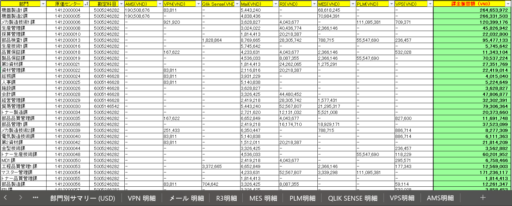

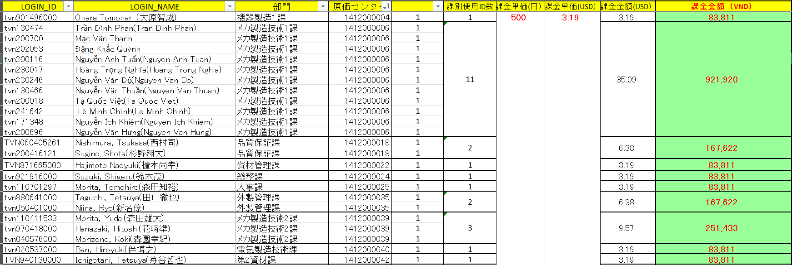

### 7.1. Mục tiêu

Sửa logic chi phí hệ thống vì hiện tại:

- Chưa lấy được công thức.
- Output vẫn là số chết.
- Công thức đang sai.
- Tổng tiền không khớp với số đúng do IT liên lạc.
- Code chi phí hệ thống đang sai hoặc có nguy cơ sai.

### 7.2. File nguồn hệ thống

Nhóm file nguồn là các file:

```text
システム課金金額(Simulation)_FY2027_Apr.2026 ~ June.2026.xls
システム課金金額(Simulation)_FY2027_July.2026 ~ Dec.2026(Change AMS & PLM price).xls
システム課金金額(Simulation)_FY2027_Jan.2027 ~ March.2027(Change SAP price).xls
```

Trong mỗi file có nhiều sheet, ví dụ:

- `部門別サマリー（USD）` / sheet tổng.
- VPN detail.
- Mail detail.
- R3 detail.
- MES detail.
- PLM detail.
- Qlik Sense detail.
- VPS detail.
- AMS detail.
- Các sheet detail khác tùy file.

### 7.3. Công thức chi tiết

Mỗi sheet detail tính theo logic:

```text
chi phí detail = số user / số người / số ID sử dụng * đơn giá USD
```

Ví dụ trong file yêu cầu:

```text
Phòng code 1412000006 = 11 * 3.19
```

### 7.4. Công thức tổng hệ thống

Tổng chi phí hệ thống cho một Cost Center:

```excel
=ROUND((tổng các chi phí USD chi tiết) * tỷ giá USD tại ô B2 trong file MP, 0)
```

Ví dụ gốc:

```excel
=ROUND((11*3.19 + 12*11.51 + 1*153.91 + 2*2114.25 + 12*2.25) * 26273, 0)
=120,399,175
```

Trong sheet tổng có thể là:

```text
120,399,176
```

Lý do:

```text
Do chênh lệch tỷ giá/làm tròn, có thể lệch 1 vài đồng so với sheet tổng.
```

### 7.5. Rule đối chiếu và điều chỉnh

Bắt buộc:

1. Lọc từng sheet detail theo Cost Center.
2. Tạo công thức tổng từ các detail.
3. So sánh kết quả công thức với sheet tổng.
4. Nếu lệch rất nhỏ do rounding, điều chỉnh/ghi audit theo quy tắc an toàn.
5. Không được âm thầm bỏ qua nếu lệch lớn.

Đề xuất ngưỡng:

| Mức lệch | Xử lý |
|---:|---|
| 0 | OK |
| ±1 đến ±5 VND | WARN_ROUNDING, có thể khớp theo sheet tổng hoặc ghi adjustment nhỏ nếu yêu cầu |
| > ±5 VND | ERROR_REVIEW, không tự động coi là đúng |

### 7.6. Nhập vào FORM

HISTORICAL_04_06_CONTEXT: lineage 04.06 ghi nhận yêu cầu System Cost như sau, và chỉ dùng nếu không mâu thuẫn với canonical 10.07.2026:

```text
Nhập vào 1 dòng duy nhất.
```

Nghĩa là:

- Không tạo nhiều dòng VPN/Mail/R3/MES/... trong FORM.
- Gộp detail thành **1 dòng chi phí hệ thống**.
- Không hardcode dòng 75 nếu output đang theo mode thứ tự file hoặc nếu FORM writer tìm được dòng system cost phù hợp theo layout mới.
- Vẫn giữ công thức `ROUND(...*$B$2,0)` hoặc công thức tương đương có tỷ giá FORM.
- Audit vẫn phải lưu detail từng thành phần/sheet nguồn để kiểm tra lại.

### 7.7. Account code đúng cho chi phí hệ thống

Trong sheet `勘定科目`, tài khoản hệ thống nội bộ/KDC system có các mã:

| Group | Account code | JPN |
|---|---:|---|
| 製造 | `5005246282` | `ＫＤＣシステム使用料（製）` |
| 一般 | `6005146628` | `ＫＤＣシステム使用料（一般）` |
| 販売 | `6005146542` | `ＫＤＣシステム使用料（販売）` |

Cách chọn:

```text
Cost Center -> 原価センタ.原価区分 -> chọn mã tương ứng trong bảng trên.
```

Ví dụ:

```text
1412000006 -> 原価区分 = 製造 -> account_code = 5005246282
1412000086 -> 原価区分 = 一般 -> account_code = 6005146628
1412000030 -> 原価区分 = 販売 -> account_code = 6005146542
```

### 7.8. Tháng áp dụng

File yêu cầu có thêm bước:

```text
Xác nhận số người cần dự tính của từng tháng để nhập cho các tháng, ví dụ người nghỉ sinh.
```

Diễn giải cho code:

- Không mặc định cùng 1 số người cho 12 tháng nếu file nguồn chia theo giai đoạn.
- 3 file hệ thống tương ứng các giai đoạn:
  - Apr-Jun.
  - Jul-Dec.
  - Jan-Mar.
- Cần map đúng giai đoạn vào đúng tháng trong FORM.
- Nếu người dùng nhập điều chỉnh số người theo tháng, công thức tháng đó phải dùng driver tương ứng.

### 7.9. Test bắt buộc

- Với Cost Center `1412000006`, công thức mẫu phải sinh được dạng gần với ví dụ:
  ```excel
  ROUND((11*3.19+12*11.51+1*153.91+2*2114.25+12*2.25)*$B$2,0)
  ```
- Output không phải số chết.
- Account code theo `原価区分` đúng.
- Chỉ có 1 dòng hệ thống trong FORM cho mỗi Cost Center/account/tháng.
- Audit có detail từng sheet nguồn.
- Nếu chênh lệch với sheet tổng, audit ghi rounding warning.

---

## 8. Sheet `Chi phí khấu hao, lãi nhà đất`

Hình tổng quan từ sheet `Chi phí khấu hao, lãi nhà đất`:

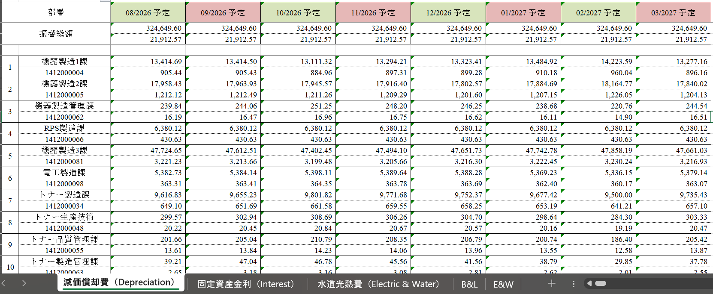


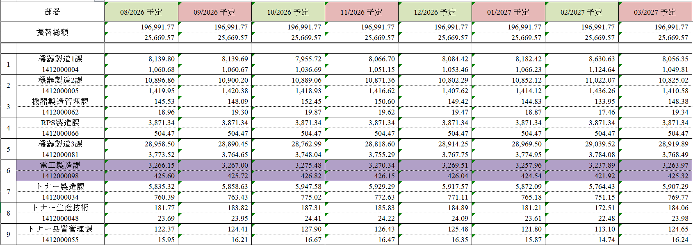

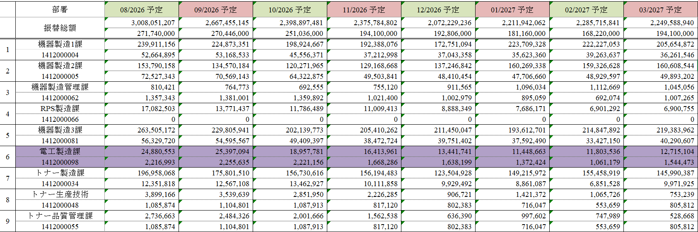

### 8.1. Mục tiêu

Nhập tự động nhóm chi phí từ file Facility:

```text
施設課　MPFY2027.xlsx
```

Bao gồm 3 nhóm chính:

1. Khấu hao nhà/đất.
2. Lãi nhà/đất.
3. Điện/nước.

### 8.2. Thứ tự chi phí

File yêu cầu ghi thứ tự:

| Thứ tự | Khoản | Cách tính/nhập |
|---:|---|---|
| 1 | Khấu hao nhà | `ROUND(chi phí khấu hao nhà * tỷ giá USD ô B2, 0)` |
| 2 | Khấu hao đất | `ROUND(chi phí khấu hao đất * tỷ giá USD ô B2, 0)` |
| 3 | Lãi nhà | `ROUND(chi phí lãi nhà * tỷ giá USD ô B2, 0)` |
| 4 | Lãi đất | `ROUND(chi phí lãi đất * tỷ giá USD ô B2, 0)` |
| 5 | Tiền điện | Copy/paste dữ liệu điện theo tháng/Cost Center |
| 6 | Tiền nước | Copy/paste dữ liệu nước theo tháng/Cost Center |

### 8.3. Quy tắc filter

File ghi chú:

```text
Tìm "code phòng chịu chi phí" để lấy dữ liệu.
Filter có khả năng mất dòng khấu hao đất/lãi đất nên làm thủ công thì không filter.
```

Diễn giải cho code:

- Không được phụ thuộc hoàn toàn vào Excel AutoFilter nhìn thấy trên UI.
- Khi đọc file bằng code, phải scan toàn bộ row/sheet.
- Match Cost Center bằng logic dữ liệu, không bỏ dòng hidden/filter.
- Nếu có nhiều dòng cùng Cost Center, phải cộng hoặc xử lý theo rule nguồn.
- Nếu không tìm thấy dòng đất/lãi đất nhưng có Cost Center liên quan, phải tạo cảnh báo.

### 8.4. Tháng áp dụng

File ghi:

```text
Phải nhập cho tất cả các tháng.
```

Tức:

- Khấu hao nhà/đất: điền tất cả 12 tháng.
- Lãi nhà/đất: điền tất cả 12 tháng.
- Điện/nước: copy dữ liệu theo tháng nếu file nguồn có breakdown.

### 8.5. Công thức phải để lại

Khấu hao/lãi nhà đất phải ghi công thức dạng:

```excel
=ROUND(source_value*$B$2,0)
```

Hoặc công thức tương đương có tham chiếu rate trong FORM.

Không được chỉ ghi số VND chết nếu có thể ghi formula.

### 8.6. HISTORICAL_04_06_CONTEXT — kết luận audit 04.06 cho Facility

`Hạng mục cần cải tiến!H182` (“6 chi phí”) link tới `Chi phí khấu hao, lãi nhà đất!J65`.
Vì vậy Facility có 6 khoản theo thứ tự:

1. Khấu hao nhà.
2. Khấu hao đất.
3. Lãi nhà.
4. Lãi đất.
5. Tiền điện.
6. Tiền nước.

Không được suy luận “6 chi phí” là gộp Facility thành 1 dòng. Sáu khoản này là thứ tự xử lý trong Facility.
Khi đọc nguồn, không được làm mất các dòng đất/lãi đất do filter/hidden row.

### 8.7. Test bắt buộc

- Scan toàn bộ sheet nguồn, không bỏ row do filter/hidden.
- Với một Cost Center có đủ nhà/đất, output phải có cả nhà và đất nếu nguồn có.
- Formula dùng `$B$2`.
- 12 tháng được điền đủ cho nhóm yêu cầu tất cả tháng.
- Điện/nước không bị nhân tỷ giá nếu nguồn đã là VND; phải xác định currency từ nguồn.

---

## 9. Sheet `Chi phí tài sản cố định`

Hình tổng quan từ sheet `Chi phí tài sản cố định`:

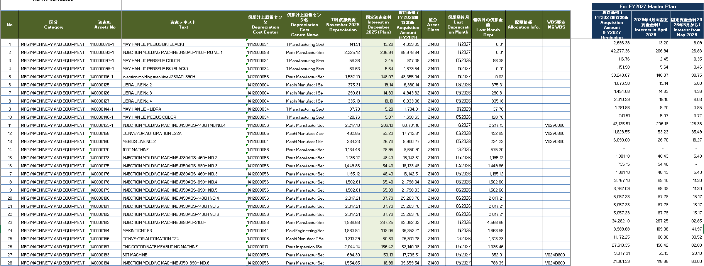

### 9.1. Mục tiêu

Tự động nhập chi phí fixed assets từ file:

```text
固定資産情報_Fixed_Assets_Information_2025.11 - Nov.xlsx
```

Nguồn chứa danh sách asset, depreciation, interest, last depreciation month, WBS, allocation info.

### 9.2. Cột nguồn quan trọng

Các trường cần đọc/chuẩn hóa:

- Asset No.
- Text / tên tài sản.
- Depreciation Cost Center.
- Depreciation Cost Center Name.
- November 2025 Depreciation.
- December 2025 Interest.
- FY2026 Ending Acquisition Amount.
- Asset Class.
- Last Depreciation Month / tháng khấu hao cuối cùng.
- Last Month Depreciation / chi phí khấu hao tháng cuối.
- Allocation Info.
- WBS.
- Interest April.
- Interest May onward hoặc cột lãi tháng 4 và từ tháng 5 trở đi nếu file nguồn tách.

### 9.3. Vùng FORM đích

File yêu cầu:

| Khoản | Vùng FORM |
|---|---|
| Khấu hao TSCĐ | Dòng 38, `F38:Q38` |
| Lãi TSCĐ | Dòng 42, `F42:Q42` |

### 9.4. Rule tổng quát

```text
① Filter Cost Center chịu chi phí.
② Xác nhận "tháng khấu hao cuối cùng" có nằm trong FY đang lập không.
③ Nếu không nằm trong FY: nhập khấu hao/lãi theo công thức bình thường cho tất cả tháng.
④ Nếu nằm trong FY: xử lý tháng trước, tháng cuối, tháng sau theo rule riêng.
```

FY2027 trong yêu cầu là:

```text
2026/04 -> 2027/03
```

### 9.5. Nếu tháng khấu hao cuối cùng KHÔNG nằm trong FY2027

Ví dụ file ghi:

```text
No.1: Tháng khấu hao cuối cùng No.3 là 11/2027 thì nhập theo công thức trên cho tất cả các tháng.
```

Rule:

- Tất cả tháng `F:Q` đều điền khấu hao bình thường:
  ```excel
  =ROUND(monthly_depreciation*$B$2,0)
  ```
- Lãi điền theo dữ liệu lãi tháng 4 và từ tháng 5 trở đi:
  ```excel
  =ROUND(monthly_interest*$B$2,0)
  ```

### 9.6. Nếu tháng khấu hao cuối cùng nằm trong FY2027

Ví dụ 1:

```text
No.3: Tháng khấu hao cuối cùng là 5/2026
```

Rule khấu hao:

| Tháng | Xử lý |
|---|---|
| 4/2026 | Theo công thức bình thường |
| 5/2026 | `ROUND(chi phí khấu hao của tháng cuối cùng * tỷ giá USD ô B2, 0)` |
| 6/2026 trở đi | Không điền |

Rule lãi:

| Tháng | Xử lý |
|---|---|
| 4/2026~5/2026 | Theo công thức lãi bình thường |
| 6/2026 trở đi | Không điền |

Ví dụ 2:

```text
No.23: Tháng khấu hao cuối cùng là 11/2026
```

Rule khấu hao:

| Tháng | Xử lý |
|---|---|
| 4/2026~10/2026 | Theo công thức bình thường |
| 11/2026 | `ROUND(chi phí khấu hao của tháng cuối cùng * tỷ giá USD ô B2, 0)` |
| 12/2026 trở đi | Không điền |

Rule lãi:

| Tháng | Xử lý |
|---|---|
| 4/2026~11/2026 | Theo công thức lãi bình thường |
| 12/2026 trở đi | Không điền |

### 9.7. Aggregation

Nếu một Cost Center có nhiều asset:

- Tính theo từng asset trước.
- Sau đó cộng vào dòng FORM theo tháng.
- Công thức FORM có thể là tổng các asset hoặc ghi giá trị tổng + audit formula detail.
- Ưu tiên để công thức rõ nếu không quá dài.

Ví dụ ý tưởng:

```excel
=ROUND((asset1_dep + asset2_dep + asset3_last_dep)*$B$2,0)
```

Nếu quá dài:

- Ghi tổng đã tính.
- Tạo audit sheet chi tiết từng asset.
- Ghi `WARN_FORMULA_TOO_LONG` nếu không thể đặt công thức.

### 9.8. Ưu tiên triển khai

File yêu cầu nói rõ:

```text
Chi phí tài sản cố định hơi khó nên để tuần sau làm cũng được.
```

Vì vậy trong kế hoạch phát triển:

- Không làm fixed assets trước.
- Làm sau `Administrative allocation` và `NNN paperwork`.
- Nhưng vẫn cần phân tích GAP để biết module hiện tại thiếu gì.

### 9.9. Test bắt buộc

- Asset có last depreciation month ngoài FY → điền đủ 12 tháng.
- Asset có last month 5/2026 → khấu hao sau tháng 5 trống/0, lãi sau tháng 5 trống/0.
- Asset có last month 11/2026 → khấu hao sau tháng 11 trống/0, lãi sau tháng 11 trống/0.
- Cột lãi tháng 4 và từ tháng 5 trở đi được lấy đúng.
- Không bỏ asset do filter/hidden.
- Audit có asset-level detail.

---

## 10. Sheet `Chi phí làm giấy tờ cho NNN`

Hình tổng quan từ sheet `Chi phí làm giấy tờ cho NNN`:

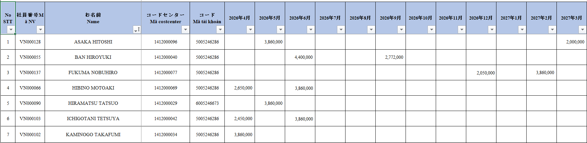

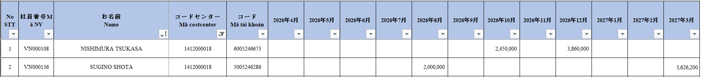

### 10.1. Mục tiêu

Bổ sung loại chi phí mới:

```text
Chi phí làm giấy tờ cho người nước ngoài / NNN
```

Nguồn file:

```text
Dự tính chi phí làm giấy tờ cho NNN FY2027.xlsx
```

### 10.2. Vùng FORM đích

File yêu cầu:

```text
Nhập vào dòng 137, từ F137 => Q137 vào file FORM
```

Tức:

| Tháng FY2027 | FORM column |
|---|---|
| Apr-2026 | F137 |
| May-2026 | G137 |
| Jun-2026 | H137 |
| Jul-2026 | I137 |
| Aug-2026 | J137 |
| Sep-2026 | K137 |
| Oct-2026 | L137 |
| Nov-2026 | M137 |
| Dec-2026 | N137 |
| Jan-2027 | O137 |
| Feb-2027 | P137 |
| Mar-2027 | Q137 |

### 10.3. Cách filter đúng

File text ghi:

```text
① Filter code tài khoản mong muốn tại cột "Code tài khoản chịu chi phí"
```

Nhưng ví dụ dùng:

```text
1412000018
```

Đây là Cost Center. Vì vậy code phải hiểu:

```text
Filter theo Cost Center / code phòng chịu chi phí, không phải account code.
```

### 10.4. Cách cộng dữ liệu

Ví dụ:

```text
Lọc code 1412000018.
Có 2 người cùng ở code đó.
Mỗi người có chi phí phân bổ rải rác vào nhiều tháng.
Lấy tất cả chi phí đó nhập vào FORM.
```

Rule:

- Lấy tất cả dòng có Cost Center = selected Cost Center.
- Với mỗi tháng, cộng tất cả chi phí của tất cả người trong tháng đó.
- Không bỏ dòng nếu một người có nhiều loại giấy tờ.
- Không bỏ dòng nếu tháng trống ở một người nhưng người khác có chi phí.
- Nếu source có mã tài khoản riêng, lưu vào audit, nhưng vùng FORM vẫn là dòng 137 theo yêu cầu.

### 10.5. Công thức hay giá trị?

File nói “nhập số tiền của các tháng”. Không yêu cầu rõ phải để công thức.
Tuy nhiên yêu cầu chung là “để lại tất cả công thức tính”.

Đề xuất an toàn:

- Nếu dữ liệu nguồn đã là VND theo tháng: có thể ghi công thức cộng các ô nguồn nếu có link/reference ổn định.
- Nếu không thể giữ external link an toàn: ghi giá trị tổng vào FORM và ghi chi tiết/công thức cộng vào audit.
- Không được tự tạo công thức sai chỉ để có công thức.

### 10.6. Test bắt buộc

- Cost Center `1412000018` có 2 người → phải cộng cả 2.
- Chi phí phân bổ rải rác nhiều tháng → từng tháng vào đúng cột.
- Dòng đích đúng `F137:Q137`.
- Không nhầm `1412000018` thành account code.
- Audit ghi danh sách nhân viên/dòng nguồn đã cộng.

---

## 11. Sheet `Chi phí sinh nhật`

Hình tổng quan từ sheet `Chi phí sinh nhật`:

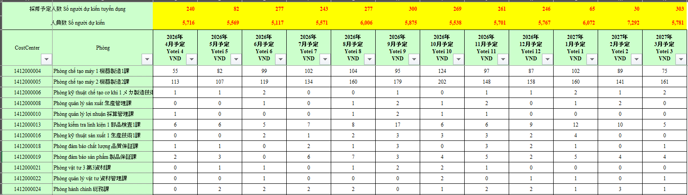

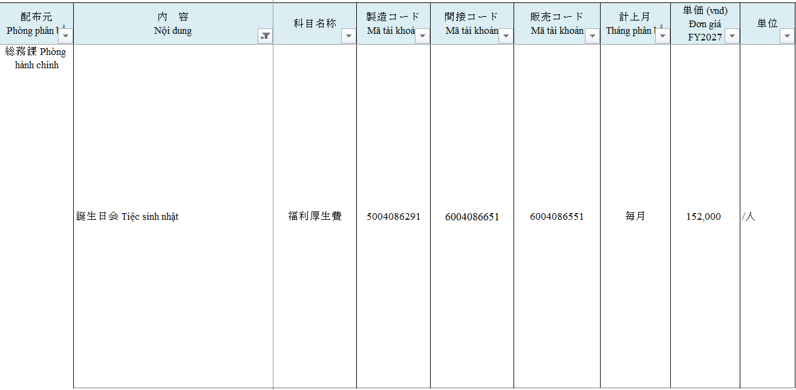

### 11.1. Mục tiêu

Tự động nhập chi phí sinh nhật từ file:

```text
Sinh nhật MP FY2027.xlsx
```

Kết hợp đơn giá từ:

```text
FY2027配賦額一覧 (2025.12.29).xlsx
```

### 11.2. Cách làm

File yêu cầu:

```text
① Filter code tài khoản mong muốn tại cột "Code tài khoản chịu chi phí"
② Lấy số người tương ứng với cột tháng
③ Filter cột nội dung của file "FY2027配賦額一覧" với nội dung: 誕生日会 Tiệc sinh nhật
④ Nhập vào FORM
Công thức = số người * đơn giá
```

Diễn giải đúng:

- Filter theo Cost Center, vì ví dụ dùng mã phòng.
- Lấy số người sinh nhật theo từng tháng.
- Lấy đơn giá từ `FY2027配賦額一覧` bằng nội dung `誕生日会 / Tiệc sinh nhật`.
- Tính:
  ```excel
  = số_người_tính_chi_phí * đơn_giá
  ```

### 11.3. Rule cộng người mới

File yêu cầu:

```text
Trong trường hợp tháng đó có người mới thì sẽ cộng luôn số người mới đó vào luôn.
```

Ví dụ:

```text
Tháng 6 phòng 1412000006 có 2 người sinh nhật.
Trong tháng đó có 1 người mới.
Tổng số người sinh nhật tính chi phí = 3.
Công thức = (2 + 1) * 152,000 VND.
```

Rule:

```text
birthday_driver[cc, month] = birthday_count_from_source[cc, month] + new_joiner_count[cc, month]
```

Lưu ý:

- `new_joiner_count` phải cùng Cost Center và cùng tháng.
- Nếu có phân loại staff/worker nhưng birthday chỉ cần tổng người, dùng tổng.
- Nếu người mới chưa có input, tạo `MISSING_INPUT_NEW_JOINER_COUNT`.

### 11.4. Đơn giá

Trong ảnh/yêu cầu có ví dụ:

```text
152,000 VND / người
```

Nhưng code không nên hardcode nếu có file `FY2027配賦額一覧`.

Rule:

```text
Đơn giá lấy từ file FY2027配賦額一覧, filter nội dung = 誕生日会 / Tiệc sinh nhật.
```

Nếu không tìm thấy:

- Không tự hardcode 152,000 trừ khi có fallback được cấu hình.
- Báo missing master/unit price.

### 11.5. Xung đột dòng FORM: dòng 63 hay dòng 59

File có 2 thông tin:

```text
Nhập vào dòng 63 (từ G63 => Q63)
Nhập vào dòng 59, từ F59 => Q59 vào file FORM
```

Diễn giải an toàn:

- Có thể dòng 63 là dòng ở file minh họa/MP đối tượng cũ.
- Có thể dòng 59 là dòng FORM đích mới.
- Vì sheet ghi rõ ở cột bên phải “Nhập vào dòng 59, từ F59 => Q59 vào file FORM”, nên kế hoạch mặc định ưu tiên:
  ```text
  FORM target = dòng 59, F59:Q59
  ```
- Nhưng agent phải kiểm tra `FORM.xlsx` trong repo:
  - Nếu account/nội dung birthday thực tế nằm dòng 63, phải tạo warning và không ghi nhầm.
  - Nên map bằng account/content thay vì hardcode row nếu có thể.

### 11.6. Test bắt buộc

- Lấy đúng birthday count theo tháng.
- Cộng thêm người mới cùng tháng.
- Lấy đơn giá từ `FY2027配賦額一覧`.
- Output là công thức, không phải chỉ số chết nếu có thể.
- Kiểm tra xung đột dòng 59/63 bằng FORM template.
- Audit ghi rõ birthday_count, new_joiner_count, unit_price.

---

## 12. Sheet `Chi phí phân bổ từ hành chính`

Đây là phần quan trọng nhất và được ưu tiên làm trước.

Hình tổng quan từ sheet `Chi phí phân bổ từ hành chính`:

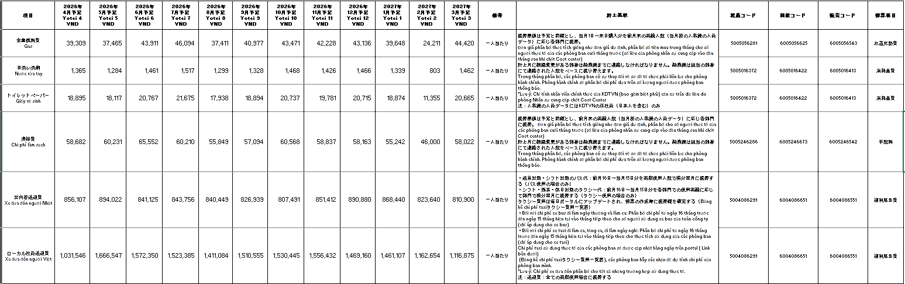

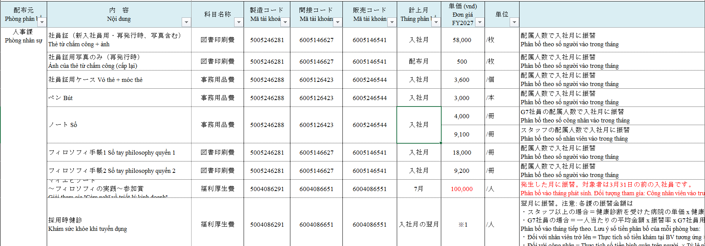

### 12.1. Nhóm 1 — chi phí phân bổ cho cả 12 tháng

Áp dụng cho:

- Tiền gas.
- Nước rửa tay.
- Giấy vệ sinh.
- Chi phí làm sạch.

Công thức:

```excel
= số_người * đơn_giá
```

Rule mới về số người:

```text
Số người = tổng số người của tháng trước.
```

Ngoại lệ:

```text
Do không có dữ liệu tháng 3 của kỳ trước nên tháng 4 vẫn lấy tổng số người của tháng 4.
```

Bảng driver:

| Tháng chi phí | Số người dùng để tính |
|---|---|
| Tháng 4/2026 | Tổng số người tháng 4/2026 |
| Tháng 5/2026 | Tổng số người tháng 4/2026 |
| Tháng 6/2026 | Tổng số người tháng 5/2026 |
| Tháng 7/2026 | Tổng số người tháng 6/2026 |
| Tháng 8/2026 | Tổng số người tháng 7/2026 |
| Tháng 9/2026 | Tổng số người tháng 8/2026 |
| Tháng 10/2026 | Tổng số người tháng 9/2026 |
| Tháng 11/2026 | Tổng số người tháng 10/2026 |
| Tháng 12/2026 | Tổng số người tháng 11/2026 |
| Tháng 1/2027 | Tổng số người tháng 12/2026 |
| Tháng 2/2027 | Tổng số người tháng 1/2027 |
| Tháng 3/2027 | Tổng số người tháng 2/2027 |

### 12.2. Nhóm 2 — chi phí đặc thù theo từng tháng

Cách lấy mã account đúng:

```text
① Xác định Cost Center chịu chi phí.
② Mở sheet 原価センタ.
③ Filter Cost Center ở cột 原価センタ.
④ Lấy 原価区分 = 製造 / 一般 / 販売.
⑤ Mở file FY2027配賦額一覧.
⑥ Filter cột nội dung 内容 theo tên chi phí.
⑦ Xác định tháng phân bổ ở cột tháng phân bổ.
⑧ Lấy tên tài khoản / account JP_Name.
⑨ Mở sheet 勘定科目.
⑩ Filter JP_Name.
⑪ Lấy account code theo cột 製造 / 一般 / 販売 tương ứng 原価区分.
⑫ Nhập account và công thức vào FORM đúng tháng.
```

Hình minh họa bảng mã tài khoản theo nhóm (từ sheet phân bổ hành chính):

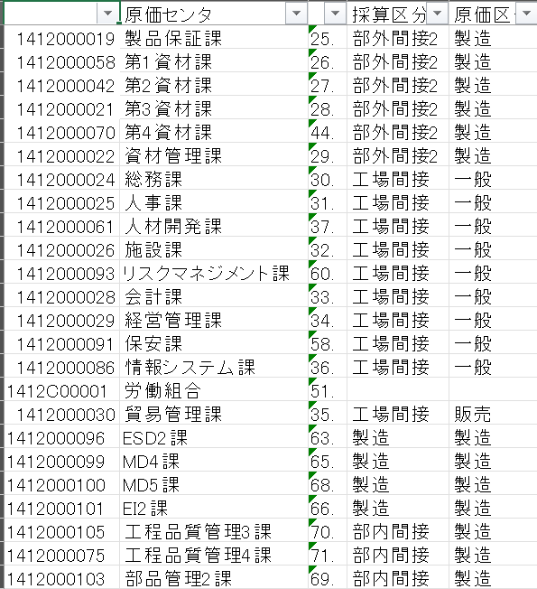

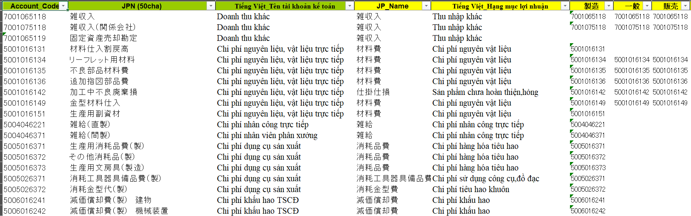

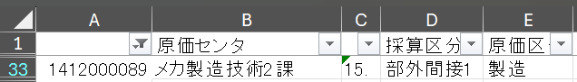

### 12.3. Lưu ý filter nội dung

File ghi:

```text
Filter giống như đầu mục trước dấu 2 chấm.
```

Nghĩa là nếu dòng mô tả:

```text
社員旅行 Du lịch công ty: Tháng 5
```

thì filter nội dung bằng:

```text
社員旅行 Du lịch công ty
```

hoặc phần tiếng Nhật/chuẩn trong master `FY2027配賦額一覧`, không kèm `: Tháng 5`.

Hình minh họa ví dụ du lịch công ty:

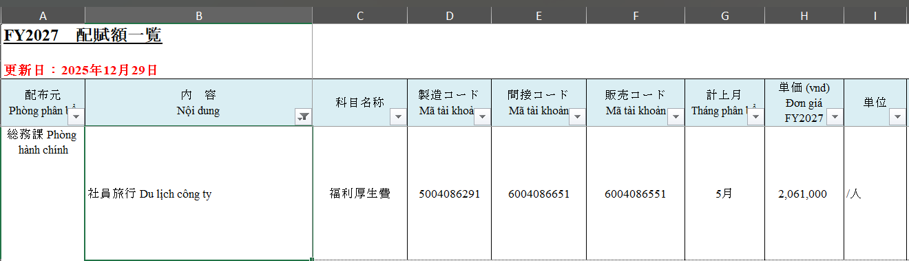

### 12.4. Ví dụ `社員旅行 / Du lịch công ty`

Ví dụ trong file:

```text
Cost Center = 1412000089
原価区分 = 製造
Content = 社員旅行 / Du lịch công ty
Month = Tháng 5
Account JP_Name = 福利厚生費
Account code for 製造 = lấy cột 製造 trong 勘定科目
Formula = Số người * Đơn giá
Đơn giá = cột H của FY2027配賦額一覧
```

Với `福利厚生費`, account theo master có thể là:

| Group | Account |
|---|---:|
| 製造 | `5004086291` |
| 一般 | `6004086651` |
| 販売 | `6004086551` |

Agent phải tra từ master, không hardcode trừ khi có table cache sinh từ master.

### 12.5. Danh sách event/hạng mục đặc thù theo tháng

Các khoản áp dụng cùng cách làm trên:

| Hạng mục | Tháng | Driver |
|---|---:|---|
| `FY2027部門方針発表会後の決起コンパ` / Tiệc chúc mừng sau buổi phát biểu phương châm bộ phận KDTVN FY2027 | Tháng 4 | Có số người riêng |
| Tiệc khuấy động năm tài chính `決起コンパ` | Tháng 5 | Theo số người phù hợp/input |
| `社員旅行` / Du lịch công ty | Tháng 5 | Driver du lịch |
| `社員旅行不参加対象者へのギフト贈呈` / Quà cho CNV không thể tham gia du lịch | Tháng 6 | Có số người riêng |
| `マイエピソード ～フィロソフィの実践～参加賞` / Giải tham gia “Cảm nghĩ về triết lý kinh doanh” | Tháng 7 | Có số người riêng |
| `京セラフェスティバル` / Lễ hội Kyocera | Tháng 9 | Theo số người phù hợp/input |
| `月餅` / Bánh Trung Thu | Tháng 9 | Theo số người phù hợp/input |
| `10年勤続記念コンパ` / Tiệc kỷ niệm 10 năm gắn bó | Tháng 10 | Có số người riêng |
| `10年勤続記念品` / Quà kỷ niệm cho CNV 10 năm gắn bó | Tháng 10 | Có số người riêng |
| `会社設立記念 感謝イベント` / Sự kiện tri ân ngày thành lập công ty | Tháng 10 | Theo số người phù hợp/input |
| `ポケットカレンダー` / Lịch bỏ túi | Tháng 11 | Theo số người phù hợp/input |
| `運動会` / Đại hội thể thao | Tháng 11 | Theo số người phù hợp/input |
| `忘年会補助金` / Hỗ trợ tiệc tất niên | Tháng 2 | Theo số người phù hợp/input |
| `お年玉` / Tiền lì xì | Tháng 2 | Theo số người phù hợp/input |
| Khám sức khỏe cho CNV nam | Tháng 12 | Số nam tháng 12 |
| Khám sức khỏe cho CNV nữ | Tháng 12 | Số nữ tháng 12 |


### 12.5.1. HISTORICAL_04_06_CONTEXT — kết luận 04.06 cho event quà không đi du lịch

Với event `社員旅行不参加対象者へのギフト贈呈` / Quà tặng cho CNV không thể tham gia du lịch:

- Không bắt buộc phải ghi vào row cố định nếu output đang chạy theo thứ tự file.
- Khi output theo thứ tự file, xử lý theo nhóm nguồn và chừa 1 dòng trống sau mỗi file nguồn.
- Không còn là blocker “phải xác nhận row đích trước mới làm được”.
- Vẫn không được dùng row 66, vì row 66 là `社員旅行` / Du lịch công ty và code đã exclude `不参加`, `gift`, `quà tặng` để tránh match nhầm.
- Commit 11 parser-level hiện đúng: `target_month=202706`, `account_jp_name=福利厚生費`, lookup `unit_price_key`, tính `amount = count * unit_price`.
- Nếu sau này user/finance xác nhận row cố định thì thêm workbook output-row test-lock riêng.

### 12.6. Khám sức khỏe định kỳ nam/nữ

File yêu cầu:

```text
Khám sức khỏe (cho CNV nam)
Khám sức khỏe (cho CNV nữ)
① → ④ giống ghi trên.
⑤ Công thức = Số người * Đơn giá.
Số người: số người nhập ban đầu khi mở phần mềm, chỗ tháng 12 đã chia rõ số người nam/nữ.
Đơn giá: cột H của FY2027配賦額一覧, đơn giá nam/nữ tương ứng.
Để lại công thức.
```

Trong ảnh có ví dụ đơn giá:

- Nam: `156,600 VND / người`
- Nữ: `170,100 VND / người`

Rule code:

- Không hardcode nếu master có đơn giá.
- Lấy đơn giá nam/nữ từ `FY2027配賦額一覧`.
- Driver:
  - Nam: `male_count_december`.
  - Nữ: `female_count_december`.
- Không được nhầm với **khám sức khỏe khi tuyển dụng**.

Hình minh họa cách tra mã tài khoản 3 nhóm:

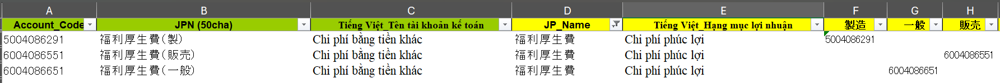

### 12.7. Nhóm chi phí cho người mới

Nguồn: Excel gốc sheet `Hạng mục cần cải tiến`, Row 214-215 (item 7: "Chưa chạy xong
các chi phí phân bổ từ hành chính — Dữ liệu từ A144~A169"), và sheet
`Chi phí phân bổ từ hành chính` Row 195-215.

File yêu cầu:

```text
Tiền chi phí cho người mới:
Công thức và cách điền tháng như hiện tại đã đúng.
Tuy nhiên, cần bổ sung thêm hạng mục bôi màu ghi dưới.
```

Các khoản hiện có vẫn giữ logic cũ nếu đã đúng, ví dụ:

- Thẻ nhân viên.
- Ảnh thẻ chấm công/cấp lại.
- Vỏ thẻ + móc thẻ.
- Bút.
- Sổ tay philosophy.
- My Episode.
- Khám sức khỏe khi tuyển dụng.

Không được phá logic cũ nếu nó đã đúng.

Hình minh họa đơn giá khám sức khỏe và chi phí người mới:

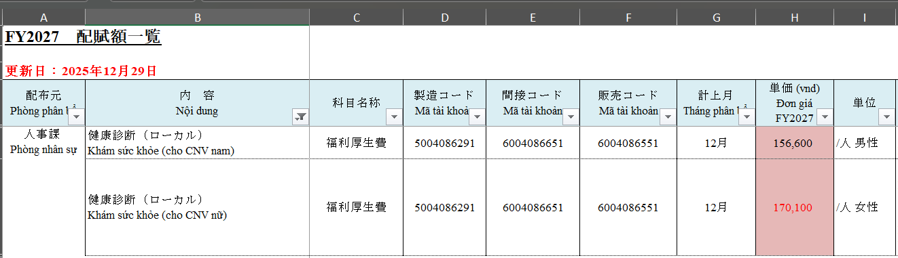

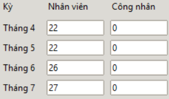

### 12.8. Bổ sung hạng mục `Sổ` phân tách nhân viên/công nhân

File ghi:

```text
Sổ: chi phí của nhân viên và công nhân khác nhau.
```

Rule:

| Đối tượng người mới | Công thức | FORM row |
|---|---|---:|
| Nhân viên mới | `số người nhân viên mới * 9,100 VND` | dòng 97 |
| Công nhân mới | `số người công nhân mới * 4,000 VND` | dòng 98 |

Lưu ý text gốc có chỗ dễ nhầm:

```text
trường hợp có người mới là nhân viên thì sẽ nhập vào ô công nhân ở chỗ nhập nhân sự thủ công
```

Câu này có thể là lỗi diễn đạt/cào OCR. Rule nghiệp vụ hợp lý là:

- Nhân viên mới → staff/new employee count.
- Công nhân mới → worker/new worker count.

Không được đảo staff/worker nếu chưa xác nhận. Nếu repo hiện tại đang dùng field tên không rõ, cần đặt lại rõ:

```python
new_staff_count
new_worker_count
```

### 12.9. Chú ý filter `入社月`

File ghi:

```text
Điểm chung của các chi phí dưới đây là ở cột Tháng phân bổ "入社月",
tuy nhiên nếu filter thì sẽ bị mất dòng chi phí sổ của nhân viên nên a làm thế nào để lấy được đủ tiền cho e nhé.
```

Yêu cầu code:

- Không phụ thuộc vào filter Excel thủ công có thể làm mất dòng.
- Khi xử lý new employee costs, phải scan toàn bộ bảng master.
- Nếu có nhiều dòng cùng `入社月`, phải lấy đủ.
- Đặc biệt không bỏ dòng `Sổ` của nhân viên.

### 12.10. Khám sức khỏe khi tuyển dụng

File yêu cầu:

```text
Người mới vào tháng này thì chi phí khám sức khỏe tuyển dụng sẽ phân bổ vào tháng sau.
VD: Tháng 6 người mới vào thì chi phí khám sức khỏe sẽ phân bổ vào tháng 7.
Nhập vào dòng 58 vào file FORM.
Công thức = số người * đơn giá.
```

Rule month shift:

| Tháng vào | Tháng ghi chi phí |
|---|---|
| Tháng 4 | Tháng 5 |
| Tháng 5 | Tháng 6 |
| Tháng 6 | Tháng 7 |
| Tháng 7 | Tháng 8 |
| Tháng 8 | Tháng 9 |
| Tháng 9 | Tháng 10 |
| Tháng 10 | Tháng 11 |
| Tháng 11 | Tháng 12 |
| Tháng 12 | Tháng 1 |
| Tháng 1 | Tháng 2 |
| Tháng 2 | Tháng 3 |
| Tháng 3 | Ngoài FY hiện tại, cần xử lý theo policy chuyển FY sau hoặc audit warning |

Cảnh báo bắt buộc:

```text
Chi phí khám sức khỏe khi tuyển dụng khác với chi phí khám sức khỏe định kỳ của công ty.
Không được lấy nhầm.
```

### 12.11. Test bắt buộc cho administrative allocation

- Gas/nước rửa tay/giấy vệ sinh/làm sạch dùng số người tháng trước, riêng tháng 4 dùng tháng 4.
- Event tháng 5 chỉ ghi vào tháng 5, không rải 12 tháng.
- Account code chọn theo `原価区分`, không theo `採算区分`.
- Filter nội dung không kèm phần `: Tháng X`.
- Khám sức khỏe nam/nữ tháng 12 dùng count nam/nữ riêng.
- Sổ nhân viên/công nhân ghi đúng dòng 97/98 và đúng đơn giá 9,100/4,000.
- Khám sức khỏe tuyển dụng shift sang tháng sau, dòng 58.
- Không nhầm khám sức khỏe tuyển dụng với khám sức khỏe định kỳ.
- Không bỏ dòng khi filter `入社月`.

---

## 13. Sheet `勘定科目` — account master

### 13.1. Vai trò

Sheet `勘定科目` là master để tra mã tài khoản kế toán.

Header:

| Cột | Tên |
|---|---|
| A | `Account_Code` |
| B | `JPN (50cha)` |
| C | `Tiếng Việt_Tên tài khoản kế toán` |
| D | `JP_Name` |
| E | `Tiếng Việt_Hạng mục lợi nhuận` |
| F | `製造` |
| G | `一般` |
| H | `販売` |
| I | `REMARK` |

### 13.2. Rule tra account

Input:

```text
JP_Name hoặc tên account lấy từ FY2027配賦額一覧.
Cost Center đang xử lý.
```

Process:

```text
1. Cost Center -> 原価センタ -> 原価区分.
2. JP_Name -> 勘定科目 row.
3. 原価区分 = 製造 -> lấy cột F.
4. 原価区分 = 一般 -> lấy cột G.
5. 原価区分 = 販売 -> lấy cột H.
```

Output:

```text
account_code
```

### 13.3. Không dùng sai cột

Trong bản Gemini có đoạn “Cột F, H, H tương ứng với 3 nhóm” do cào sai/thiếu.
Đúng phải là:

```text
Cột F = 製造
Cột G = 一般
Cột H = 販売
```

### 13.4. Nếu account trống

Nếu cột tương ứng trống:

- Không tự dùng account ở cột khác.
- Tạo `MISSING_ACCOUNT_CODE`.
- Ghi rõ:
  - Cost Center.
  - 原価区分.
  - JP_Name.
  - Sheet/source.
  - Hạng mục chi phí.

---

## 14. Sheet `原価センタ` — Cost Center master

### 14.1. Vai trò

Sheet `原価センタ` dùng để xác định nhóm chi phí/account group cho Cost Center.

Header:

| Cột | Tên |
|---|---|
| A | `原価センタ` |
| B | `テキスト` |
| C | `No.` |
| D | `採算区分` |
| E | `原価区分` |

### 14.2. Rule chính

```text
Cost Center -> lấy 原価区分
```

Ví dụ:

| Cost Center | Tên | 採算区分 | 原価区分 |
|---|---|---|---|
| `1412000006` | メカ製造技術1課 | 部外間接1 | 製造 |
| `1412000089` | メカ製造技術2課 | 部外間接1 | 製造 |
| `1412000024` | 総務課 | 工場間接 | 一般 |
| `1412000030` | 貿易管理課 | 工場間接 | 販売 |
| `1412000072` | 製品管理課 | 部内間接 | 販売 |
| `1412000098` | 電工製造課 | 製造 | 製造 |
| `1412000096` | ESD2課 | 製造 | 製造 |
| `1412000099` | MD4課 | 製造 | 製造 |
| `1412000100` | MD5課 | 製造 | 製造 |
| `1412000101` | EI2課 | 製造 | 製造 |

### 14.3. Test bắt buộc

- `1412000072` phải ra group `販売`, không phải `部内間接`.
- `1412000024` phải ra group `一般`.
- `1412000006` phải ra group `製造`.

---

## 15. Thứ tự ưu tiên triển khai theo file yêu cầu

File yêu cầu ghi rõ:

```text
A làm chi phí phân bổ từ hành chính và chi phí làm giấy tờ cho người nước ngoài trước giúp e nhé.
Còn chi phí tài sản cố định hơi khó nên để tuần sau a làm cũng được nha.
```

Thứ tự đề xuất cho agent:

### Phase 1 — Chuẩn hóa nền tảng mapping

1. Chuẩn hóa thuật ngữ Cost Center vs Account Code.
2. Load master `原価センタ`.
3. Load master `勘定科目`.
4. Viết hàm:
   ```python
   resolve_cost_group(cost_center) -> 製造/一般/販売
   resolve_account_code(jp_name, cost_center) -> account_code
   ```
5. Thêm audit framework.

### Phase 2 — NNN paperwork

1. Parse file NNN.
2. Filter theo Cost Center.
3. Cộng chi phí theo tháng.
4. Ghi dòng 137, `F137:Q137`.
5. Audit từng nhân viên/dòng nguồn.

### Phase 3 — Administrative allocation

1. Sửa input driver/UI.
2. Sửa logic 12 tháng dùng số người tháng trước.
3. Implement event đặc thù theo tháng.
4. Implement account resolution theo `原価区分`.
5. Implement health check nam/nữ.
6. Implement new employee notebook staff/worker.
7. Implement hiring medical shift tháng sau.
8. Test đầy đủ.

### Phase 4 — System cost

1. Parse 3 file system `.xls`.
2. Gom detail thành công thức.
3. Ghi 1 dòng duy nhất.
4. Sửa account code KDC system.
5. Compare với sheet tổng và audit rounding.

### Phase 5 — FORM style/formula preservation

1. Copy template an toàn.
2. Chỉ ghi ô đích.
3. Preserve style.
4. Kiểm tra output không mất format/công thức.

### Phase 6 — Birthday

1. Parse birthday source.
2. Lấy đơn giá từ allocation master.
3. Cộng người mới.
4. Xử lý xung đột dòng 59/63.

### Phase 7 — Facility

1. Khấu hao/lãi nhà đất.
2. Điện/nước.
3. Scan toàn bộ row, tránh mất dòng do filter.

### Phase 8 — Fixed assets

1. Parse asset list.
2. Xử lý last depreciation month.
3. Aggregate theo Cost Center.
4. Ghi dòng 38/42.

---

## 16. GAP cần agent kiểm tra trong repo hiện tại

Khi đọc repo `PhanmemsaisanMP`, agent phải lập bảng GAP theo các nhóm:

| Nhóm | Cần kiểm tra |
|---|---|
| Loader | Có đọc được `.xlsx` và `.xls` chưa? Có đọc được file tiếng Nhật không? |
| Source manifest | `source_file_order` đã có đủ file chưa? |
| Master data | Có load `勘定科目` và `原価センタ` đúng chưa? |
| Account resolver | Có dùng `原価区分` chưa hay đang dùng sai `採算区分`? |
| Cost Center handling | Có nhầm Cost Center thành account code không? |
| FORM writer | Có giữ format/công thức không? |
| NNN | Có module chưa? Dòng 137 đúng chưa? |
| Admin allocation | Có logic tháng trước chưa? Có event riêng chưa? |
| System cost | Có để formula không? Có account KDC đúng không? |
| Birthday | Có cộng người mới chưa? Có xử lý dòng 59/63 chưa? |
| Facility | Có scan tránh mất row do filter không? |
| Fixed assets | Có xử lý last depreciation month chưa? |
| Audit | Có audit trace đủ không? |
| Tests | Có unit/integration/golden output không? |

---

## 17. Các test tối thiểu cần viết

### 17.1. Master resolver tests

```text
test_cost_center_group_uses_genka_kubun_not_saisan_kubun
test_resolve_kdc_system_account_for_manufacturing
test_resolve_kdc_system_account_for_general
test_resolve_kdc_system_account_for_sales
test_missing_account_code_reports_warning
```

### 17.2. NNN tests

```text
test_nnn_filters_by_cost_center_not_account_code
test_nnn_sums_multiple_people_same_cost_center
test_nnn_writes_to_row_137_f_to_q
test_nnn_audit_contains_employee_level_sources
```

### 17.3. Administrative allocation tests

```text
test_admin_12_month_cost_uses_previous_month_headcount
test_admin_april_uses_april_headcount
test_admin_event_uses_month_specific_driver
test_admin_event_resolves_account_by_cost_group
test_health_check_male_female_use_december_split
test_new_employee_notebook_staff_worker_rows_97_98
test_hiring_medical_check_shifts_to_next_month_row_58
test_hiring_medical_not_confused_with_periodic_health_check
test_filter_nyusha_month_does_not_drop_staff_notebook
```

### 17.4. System cost tests

```text
test_system_cost_outputs_formula_not_static_number
test_system_cost_aggregates_detail_sheets_into_one_row
test_system_cost_compares_summary_total_with_rounding_tolerance
test_system_cost_uses_correct_kdc_account_by_cost_group
```

### 17.5. Birthday tests

```text
test_birthday_uses_unit_price_from_allocation_master
test_birthday_adds_new_joiners_same_month
test_birthday_writes_to_confirmed_form_row
test_birthday_detects_row_59_63_conflict
```

### 17.6. Facility tests

```text
test_facility_depreciation_building_land_all_months
test_facility_interest_building_land_all_months
test_facility_electric_water_copy_monthly_values
test_facility_scan_does_not_lose_land_rows_due_to_filter
```

### 17.7. Fixed assets tests

```text
test_fixed_asset_last_month_outside_fy_fills_all_months
test_fixed_asset_last_month_may_stops_after_may
test_fixed_asset_last_month_november_stops_after_november
test_fixed_asset_interest_stops_month_after_last_depreciation
test_fixed_asset_aggregates_multiple_assets_same_cost_center
```

### 17.8. FORM output tests

```text
test_form_preserves_styles
test_form_preserves_existing_formulas
test_form_writes_only_allowed_ranges
test_form_month_columns_f_to_q_are_correct
test_audit_report_has_source_file_sheet_filter_formula
```

---

## 18. Các điểm cần xác nhận trước khi code mạnh

Những điểm này chưa nên tự suy luận nếu không kiểm tra thêm FORM/repo:

1. **2 dữ liệu nhân sự không cần điền**
   Xác nhận là bỏ nhập giá trị hay xóa/ẩn dòng khỏi output.

2. **Birthday dòng 59 hay 63**
   Mặc định ưu tiên dòng 59 `F59:Q59` vì file ghi “vào file FORM”, nhưng phải đối chiếu `FORM.xlsx`.

3. **“6 chi phí / gộp thành 1 dòng chi phí”**
   Đã xác nhận lần đầu trong `HISTORICAL_04_06_CONTEXT` và chỉ giữ nếu không mâu thuẫn với canonical 10.07.2026: “6 chi phí” áp dụng cho Facility 6 khoản theo thứ tự; “gộp thành 1 dòng chi phí” áp dụng cho System Cost.

4. **Đơn giá khám sức khỏe tuyển dụng**
   Cần xác định nguồn đơn giá trong `FY2027配賦額一覧` hoặc file hành chính.

5. **Input tháng 3 FY cũ — tiền triết lý**
   Cần xác định chính xác hạng mục nào sử dụng driver này trong repo/source hiện tại.

6. **Các khoản event không ghi “có số người riêng”**
   Cần xác định dùng tổng headcount, driver riêng trong `event_drivers_manual.csv`, hay input UI.

---

## 19. Checklist agent trước khi sửa code

Trước khi sửa code, agent phải:

- [ ] Đọc file yêu cầu này.
- [ ] Đọc `FORM.xlsx`.
- [ ] Đọc `FY2027配賦額一覧`.
- [ ] Đọc `原価センタ` và `勘定科目`.
- [ ] Đọc repo hiện tại.
- [ ] Lập GAP theo module.
- [ ] Không sửa Fixed Assets trước NNN/Admin.
- [ ] Không hardcode account nếu có thể tra master.
- [ ] Không nhầm Cost Center với Account Code.
- [ ] Không paste số chết ở nơi yêu cầu công thức.
- [ ] Không phá format FORM.
- [ ] Không bỏ audit.

---

## 20. Prompt đề xuất để giao cho agent code

```text
Bạn hãy đọc repo PhanmemsaisanMP và file kế hoạch cai_tien_nhap_du_lieu_chung.md này.
Không code ngay. Trước tiên lập bảng GAP chi tiết giữa yêu cầu và code hiện tại:
- module/file Python hiện có,
- logic đã đúng,
- logic sai,
- logic thiếu,
- test hiện có,
- test cần thêm.

Ưu tiên phân tích theo thứ tự:
1. Master resolver Cost Center -> 原価区分 -> Account Code.
2. Chi phí làm giấy tờ cho NNN.
3. Chi phí phân bổ từ hành chính.
4. Chi phí hệ thống.
5. FORM writer giữ format/công thức.
6. Chi phí sinh nhật.
7. Facility.
8. Fixed Assets.

Sau khi lập GAP, đề xuất kế hoạch sửa nhỏ theo phase, mỗi phase có test gate rõ ràng. Không tự ý gộp 6 chi phí Facility thành 1 dòng; chỉ System Cost phải gộp thành 1 dòng nếu rule này vẫn khớp canonical 10.07.2026. Không nhầm mã 1412... là account code.
```

---

## 21. Tóm tắt ngắn cho người không chuyên

File yêu cầu này muốn chương trình MP2027 làm tự động phần nhập dữ liệu chi phí chung vào FORM.
Điểm quan trọng nhất là chương trình phải:

- Lấy đúng dữ liệu theo phòng.
- Tự tìm đúng mã tài khoản kế toán.
- Điền đúng tháng.
- Giữ công thức.
- Giữ mẫu FORM đẹp như ban đầu.
- Ưu tiên làm trước chi phí hành chính và chi phí giấy tờ người nước ngoài.
- Không được nhầm mã phòng `1412...` với mã tài khoản kế toán.
- Không được tự ý paste số chết hoặc gộp chi phí sai.

---

## 22. Historical layout output evidence from the 09.06.2026 file

> **Nguồn gốc**: Các rule dưới đây được trích xuất trực tiếp từ workbook 09.06.2026,
> `Cải tiến nhập dữ liệu chung vào file MPnew 09.06.2026.xlsx`.
> Đây là bằng chứng lịch sử, **không phải suy diễn** của agent; phải đối chiếu lại với workbook canonical 10.07.2026 trước khi triển khai.

Hình tổng quan layout output từ Excel gốc:


Thứ tự chi phí output (lặp lại từ Row 221-236):


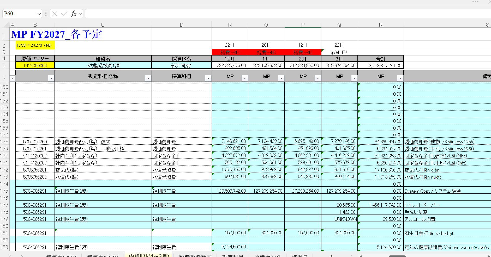

### 22.1. Dữ liệu output bắt đầu từ dòng 38

Theo FORM QLLN mới ngày 21.07.2026, file kết quả phải xuất dữ liệu chi phí chung từ **dòng 38** trở đi.
Các dòng 30~37 là vùng dữ liệu/layout cố định của FORM, phải được giữ nguyên cả giá trị, công thức và định dạng.

### 22.2. Cột A đến D từ dòng 38 trở đi phải màu trắng

Từ cột A đến cột D, dòng 38 trở đi phải có **màu trắng** (không fill color / background trắng).
Không được tô màu nền khác cho vùng A:D ở khu vực dữ liệu output.

### 22.3. Cột E từ dòng 38 trở xuống không được có giải thích

Cột E từ dòng 38 trở xuống **không được có giải thích** / diễn giải do agent tự nghĩ.
Nếu cột E cần chứa nội dung, nội dung đó phải lấy nguyên từ nguồn dữ liệu canonical,
không được tự sáng tạo hoặc dịch thêm.

### 22.4. Giải thích/diễn giải phải lấy từ cột B của sheet `*配賦額一覧`

Phần giải thích/diễn giải cho các hạng mục chi phí **không được tự nghĩ**.
Nếu cần lấy diễn giải, phải lấy từ **cột B** của sheet `*配賦額一覧` trong file nguồn
(ví dụ `FY2027配賦額一覧 (2025.12.29).xlsx`).

Rule:
- Không tự dịch, không tự diễn giải, không tự thêm ghi chú vào output nếu không có
  trong cột B của sheet `*配賦額一覧`.
- Nếu cột B trống hoặc không có hạng mục tương ứng, để trống, không tự điền.

### 22.5. Workbook Excel gốc thắng markdown khi mâu thuẫn

Khi có mâu thuẫn giữa tài liệu markdown này và workbook Excel canonical
`Cải tiến nhập dữ liệu chung vào file MPnew 10.07.2026.xlsx`,
**workbook Excel gốc luôn được ưu tiên** (canonical wins).

Điều này đã được ghi ở Section 0 nhưng được nhắc lại ở đây để nhấn mạnh:
markdown chỉ là diễn giải; source of truth là workbook 10.07.2026.

### 22.6. Không quay lại cách xuất cố định theo từng dòng

Không quay lại logic cũ xuất output cố định theo dòng (hardcode row cho từng hạng mục).
Output phải theo source-order hoặc dynamic placement, trừ các dòng đã được workbook
xác nhận cụ thể (ví dụ dòng 137 cho NNN, dòng 38/42 cho fixed assets).

### 22.7. Không hardcode Cost Center `1412000040`

Không được hardcode Cost Center `1412000040` làm default trong export logic.
Tất cả Cost Center phải được xác định từ input của người dùng hoặc từ danh sách
master `原価センタ`, không dùng giá trị cố định.

> **Ghi chú audit**: Mã `1412000040` chỉ được nhắc đến trong ngữ cảnh
> "không hardcode" hoặc ví dụ minh họa. Không sử dụng làm fallback/default
> trong bất kỳ hàm export nào.

### 22.8. Không hardcode/map riêng file `16.KDTVN 電気製造技術課_MP FY2027_各予定(Ver01)`

Không được hardcode hoặc map riêng file
`16.KDTVN 電気製造技術課_MP FY2027_各予定(Ver01)` trong Python.
Logic export phải generic, hoạt động với mọi file FORM output
mà không cần đặc biệt hóa cho bất kỳ file cụ thể nào.

### 22.9. Xóa nội dung cũ trước khi xuất output mới

> **Nguồn**: Excel gốc sheet `Hạng mục cần cải tiến`, Row 197 (item 2):
> `"Xóa nội dung dưới đây"`

Khi xuất output mới, phải **xóa/clear toàn bộ nội dung cũ** trong vùng output
(từ dòng 38 đến hết vùng dữ liệu) trước khi ghi dữ liệu mới.

Rule:
- Không được ghi đè lên dữ liệu cũ mà không clear trước.
- Nếu output mới ngắn hơn output cũ, các dòng thừa phải trống.
- Code hiện tại dùng `clear_until_row` trong `complete_v1_source_order_writer`
  để đảm bảo điều này.

---

## 23. Trạng thái hoàn thiện theo Excel gốc 09.06.2026

> **Nguồn**: Excel gốc sheet `Hạng mục cần cải tiến`, Row 194-266.
> Ngày ghi: 09.06.2026.

Bảng dưới đây ghi lại trạng thái từng hạng mục theo Excel gốc,
giúp track xem hạng mục nào người dùng coi là "đã xong" và hạng mục nào
"chưa xong / cần sửa".

| # | Hạng mục (Excel gốc) | Trạng thái theo Excel | Ghi chú |
|---|---|---|---|
| 1 | File kết quả xuất từ dòng 38; bảo toàn dòng 30~37 | FORM QLLN 21.07.2026 | Đã implement (start_row=38) |
| 2 | Xóa nội dung cũ | Yêu cầu mới 09.06 | Đã implement (clear_until_row) |
| 3 | Bổ sung nhập số người bus biệt phái/VN | Yêu cầu mới 09.06 | Đã có manual input |
| 4 | Chi phí TSCĐ | **Chưa chạy hết tất cả CC** | Cần audit thêm |
| 5 | Chi phí khám sức khỏe | **Đang bị lặp 2 lần** | Xem Section 24.1 |
| 6 | Chi phí VPP người mới | **Đang bị sai** (gom tháng 12) | Xem Section 24.2 |
| 7 | Chi phí phân bổ hành chính | **Chưa chạy xong** (A144~A169) | Section 12.7 |
| 8 | Bổ sung thêm mô tả | Yêu cầu mới 09.06 | Xem Section 25 |
| 9 | Không xuất theo dòng cố định | Yêu cầu mới 09.06 | Đã implement (source-order) |
| 10 | Cột A-D trắng, cột E không giải thích | Yêu cầu mới 09.06 | Section 22.2, 22.3 |
| 11 | Giải thích lấy từ cột B `*配賦額一覧*` | Yêu cầu mới 09.06 | Section 22.4 |

> **Lưu ý**: Các hạng mục đánh dấu **in đậm** là hạng mục mà Excel gốc
> ghi là chưa hoàn thiện hoặc đang có bug. Không được coi các hạng mục này
> là "đã xong" trong bất kỳ audit nào trừ khi đã verify bằng test.

---

## 24. Regression guard — các bug đã biết từ Excel gốc

> **Mục đích**: Ghi lại các bug/lỗi cụ thể mà Excel gốc 09.06.2026 đã chỉ ra.
> Khi sửa code hoặc refactor, phải kiểm tra KHÔNG tái phát các bug này.

### 24.1. Khám sức khỏe định kỳ bị lặp 2 lần

> **Nguồn**: Excel gốc sheet `Hạng mục cần cải tiến`, Row 208-209 (item 5):
> `"Chi phí khám sức khỏe — Đang bị lặp 2 lần"`

Bug cũ: chi phí khám sức khỏe định kỳ (nam/nữ) bị xuất ra 2 lần trong output,
dẫn đến tổng chi phí bị x2.

Rule phòng tránh:
- Mỗi hạng mục khám sức khỏe (nam, nữ) chỉ được xuất **đúng 1 lần** trong output.
- Nếu có nhiều dòng source cùng account code khám sức khỏe, phải gộp chứ không nhân đôi.
- Test phải kiểm tra output không có 2 dòng cùng account khám sức khỏe cho cùng CC.

### 24.2. Chi phí người mới bị gom hết vào tháng 12

> **Nguồn**: Excel gốc sheet `Hạng mục cần cải tiến`, Row 211-212 (item 6):
> `"Chi phí văn phòng phẩm của người mới đang bị sai"`
> `"Tất cả các chi phí người mới đang bị nhập vào tháng 12 và nhân với tổng số người"`

Bug cũ: tất cả chi phí người mới (VPP, sổ, thẻ, v.v.) bị gom vào **tháng 12**
và nhân với **tổng số người** thay vì phân bổ theo tháng nhập việc.

Root cause: code cũ không phân biệt tháng nhập việc, mặc định dồn hết tháng 12.

Rule đúng (đã ghi ở Section 12.7):
- Số người mới = số người tháng sau - số người tháng trước.
- Chi phí người mới phải phân bổ vào **tháng nhập việc** (入社月), không phải tháng 12.
- Riêng khám sức khỏe tuyển dụng: phân bổ vào **tháng sau** tháng nhập việc (Section 12.10).

Test phải kiểm tra:
- Chi phí người mới KHÔNG tập trung hết vào tháng 12.
- Nếu tháng 6 có 4 người mới, chi phí VPP/sổ phải nằm ở tháng 6, không phải tháng 12.

---

## 25. Yêu cầu bổ sung mô tả

> **Nguồn**: Excel gốc sheet `Hạng mục cần cải tiến`, Row 218 (item 8):
> `"Bổ sung thêm mô tả"`

Excel gốc ghi yêu cầu "bổ sung thêm mô tả" nhưng **không ghi rõ** mô tả gì,
ở đâu, cho hạng mục nào.

Trạng thái: `NEEDS_CLARIFICATION` — cần hỏi lại người dùng để xác nhận:

- "Mô tả" ở đây là mô tả cho cột nào trong FORM output? (cột E? cột S?)
- Mô tả lấy từ nguồn nào? (cột B của `*配賦額一覧*`? hay nguồn khác?)
- Áp dụng cho tất cả chi phí hay chỉ nhóm cụ thể?

Cho đến khi được clarify, không tự sáng tạo mô tả trong output.
Rule Section 22.3 và 22.4 vẫn áp dụng: không tự nghĩ giải thích.

---

## 26. User claims — lỗi người dùng phát hiện khi sử dụng chương trình

> **Nguồn**: Excel gốc sheet `Hạng mục cần cải tiến`, Row 267-339.
> Đây là các lỗi/claim mà người dùng (Nguyễn Thị Phương Anh) ghi nhận
> khi dùng chương trình xuất file kết quả `MP_CC_1412000006.xlsx`.
> File xuất từ chương trình: `D:\SETUP\tvn183660\download\MP_CC_1412000006.xlsx`

### 26.1. Claim 12: Cột E không được phép tồn tại mô tả

> **Excel Row 268** (item 12):
> `"Lỗi người dùng claim khi xuất file: Cột E không được phép tồn tại mô tả."`

Người dùng xác nhận lại: cột E trong file output **không được có mô tả/giải thích**.
Đây là lần xác nhận thứ hai (lần đầu ở Section 22.3, item 10 Row 239).

Rule:
- Cột E từ dòng 38 trở xuống phải **hoàn toàn trống** hoặc chỉ chứa nội dung
  lấy nguyên từ nguồn dữ liệu canonical.
- Không được agent tự viết/dịch/diễn giải bất kỳ text nào vào cột E.

Hình minh họa từ output thực tế (cột E đang có text do agent tự viết):

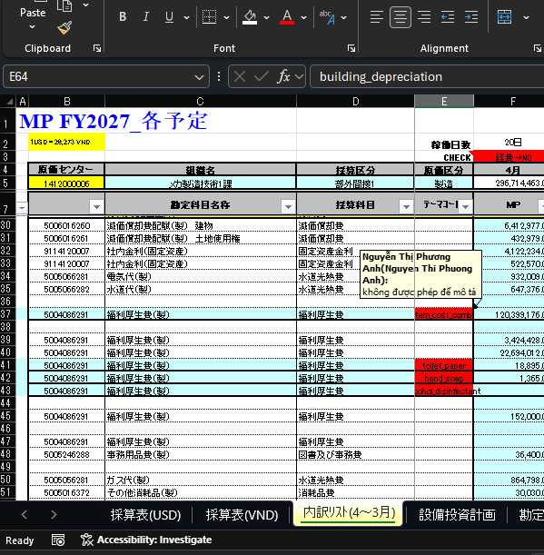

### 26.2. Claim 13: Chưa có tiền du lịch của tháng 5

> **Excel Row 268 cột M** (item 13):
> `"Chưa có tiền du lịch của tháng 5"`

Output thiếu chi phí `社員旅行 Du lịch công ty` cho tháng 5.
Chi phí này thuộc nhóm chi phí đặc thù theo tháng (Section 12.2, 12.4).

Rule:
- Phải kiểm tra output có dòng chi phí du lịch công ty ở cột tháng 5.
- Nếu thiếu, điều tra xem filter nội dung `社員旅行` trong `FY2027配賦額一覧`
  có đang bỏ sót không.

Hình minh họa:

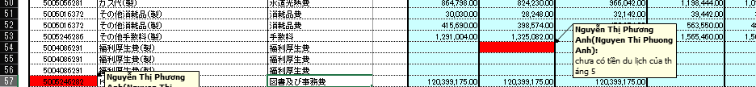

### 26.3. Claim 14: Code 5005246282 chỉ chạy được từ tháng 4 đến tháng 6

> **Excel Row 279 cột M** (item 14):
> `"Code 5005246282 đang chỉ chạy được từ tháng 4 đến tháng 6"`

Account code `5005246282` chỉ có dữ liệu từ tháng 4-6, thiếu các tháng còn lại.
Cần điều tra:
- Liệu source data (file phân bổ) có dữ liệu cho các tháng 7-3 không?
- Hay code đang filter sai khiến mất dữ liệu các tháng sau tháng 6?

Hình minh họa:

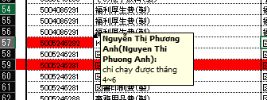

### 26.4. Claim 15: Tháng 12 đang mặc định nhân chi phí người mới với tổng số người

> **Excel Row 289 cột M** (item 15):
> `"Code 5005246281, 5005246281, 5005246281, 5005246281, 5005246288, 5005246288`
> `như hình đang bị claim: tháng 12 đang mặc định nhân chi phí của người mới`
> `với tổng số người (sai với yêu cầu)"`

Đây là xác nhận lại bug đã ghi ở Section 24.2 (GAP-5).
Các account codes bị ảnh hưởng:
- `5005246281` (xuất hiện 4 lần — có thể là 4 loại chi phí khác nhau cùng code)
- `5005246288` (xuất hiện 2 lần)

Tháng 12 đang sai: nhân chi phí người mới × **tổng số người** thay vì × **số người mới**.

Hình minh họa (các dòng đỏ là dòng sai):

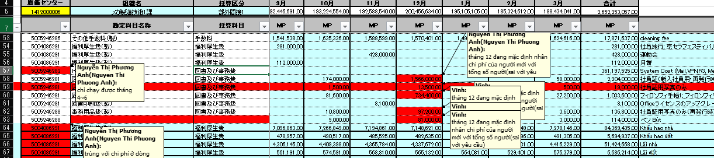

### 26.5. Claim 16: Chi phí `社員証用写真のみ` không cần cho người mới

> **Excel Row 306 cột M** (item 16):
> `"chi phí 社員証用写真のみ không cần cho người mới"`

Chi phí ảnh thẻ nhân viên (`社員証用写真のみ`) **không áp dụng** cho người mới.
Code hiện tại đang nhầm, gộp chi phí này vào nhóm "chi phí người mới".

Rule:
- Loại bỏ `社員証用写真のみ` khỏi danh sách chi phí người mới.
- Chỉ tính ảnh thẻ cho tổng nhân sự (không liên quan đến new employee count).

Hình minh họa:

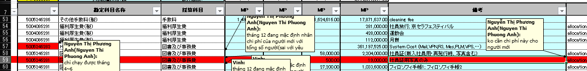

### 26.6. Claim 17: Dòng `ペン Bút` thiếu dữ liệu cột C, D

> **Excel Row 316 cột M** (item 17):
> `"5005246288 ... ペン Bút -> ở dòng này đang thiếu dữ liệu của cột C, D"`

Dòng chi phí bút (`ペン Bút`, account `5005246288`) trong output thiếu dữ liệu
ở cột C và cột D. Cần điều tra:
- Cột C, D trong FORM output thường chứa gì? (account code, tên tài khoản?)
- Source data có đủ thông tin để điền C, D không?

Hình minh họa:

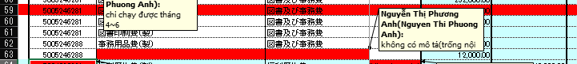

### 26.7. Claim 18: Dòng 64-69 trùng với dòng 30-35 nhưng code chi phí sai

> **Excel Row 323 cột M** (item 18):
> `"Những dòng 64~69, người dùng nói nó đang trùng với chi phí ở dòng từ 30~35`
> `nhưng code chi phí thì sai? Điều tra và fix triệt để (không hardcode dòng dữ liệu)"`

Người dùng phát hiện:
- Dòng 64-69 trong output chứa dữ liệu **trùng** với dòng 30-35.
- Nhưng account code ở dòng 64-69 **sai** (khác với account code ở dòng 30-35).

Rule:
- Điều tra xem tại sao có duplicate data giữa 2 block.
- Không được hardcode dòng để fix — phải fix logic gốc.
- Có thể là do source data có 2 entries cho cùng chi phí nhưng khác account,
  hoặc code đang ghi 2 lần.

Hình minh họa:

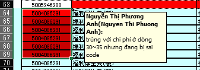

### 26.8. Claim 19: Không có chi phí ở dòng 73, 74, 75

> **Excel Row 331 cột M** (item 19):
> `"Không có chi phí ở dòng 73, 74, 75? Điều tra và fix triệt để`
> `(không hardcode dòng dữ liệu)"`

Dòng 73-75 trong output trống, không có chi phí.
Cần điều tra:
- Dòng 73-75 nên chứa chi phí gì? (dựa vào FORM template)
- Source data có dữ liệu cho các dòng này không?
- Có phải code đang bỏ qua 1 số loại chi phí?

Rule: Không hardcode dòng — fix logic gốc để output đầy đủ.

Hình minh họa:

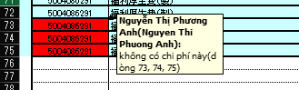

---

### 26.9. Tổng hợp claims và phân loại

| Claim | Loại lỗi | Mức độ | Liên quan section |
|---|---|---|---|
| 12 | Layout: cột E có mô tả sai | 🔴 Nghiêm trọng | 22.3, 22.4 |
| 13 | Thiếu dữ liệu: du lịch tháng 5 | 🔴 Nghiêm trọng | 12.4 |
| 14 | Thiếu dữ liệu: code 5005246282 chỉ có 3 tháng | 🟡 Quan trọng | 12.2 |
| 15 | Logic sai: người mới × tổng số người ở tháng 12 | 🔴 Nghiêm trọng | 24.2, 12.7 |
| 16 | Logic sai: ảnh thẻ không phải chi phí người mới | 🟡 Quan trọng | 12.7 |
| 17 | Thiếu dữ liệu: dòng Bút thiếu cột C, D | 🟡 Quan trọng | — |
| 18 | Duplicate: dòng 64-69 trùng dòng 30-35 + sai code | 🔴 Nghiêm trọng | — |
| 19 | Thiếu dữ liệu: dòng 73-75 trống | 🟡 Quan trọng | — |

> **Ghi chú**: Tất cả claim 12-19 trên đều từ file output `MP_CC_1412000006.xlsx`.
> Người dùng nhấn mạnh: **không hardcode dòng dữ liệu** để fix (Claim 18, 19).

---

## 27. Yêu cầu bổ sung — item 20: Chi phí event theo tháng chưa chạy được

> **Nguồn**: Excel gốc sheet `Hạng mục cần cải tiến`, Row 341-343 (item 20).
> Ngày bổ sung: 09.07.2026.

### 27.1. Nội dung yêu cầu

> **Excel Row 341 cột F** (item 20):
> `"Trong sheet: 'Chi phí phân bổ từ hành chính', dòng 95:`
> `社員旅行 Du lịch công ty: Tháng 5,`
> `Tiệc khuấy động năm tài chính 決起コンパ: Tháng 5,`
> `会社設立記念 感謝イベント Sự kiện tri ân ngày thành lập công ty: Tháng 10,`
> `ポケットカレンダー Lịch bỏ túi: Tháng 11,`
> `忘年会補助金 Hỗ trợ tiệc tất niên: Tháng 2,`
> `お年玉 Tiền lì xì: Tháng 2`
> `vẫn chưa chạy được chi phí"`

Các khoản chi phí event theo tháng (Section 12.5) chưa được chương trình tính.
Danh sách cụ thể:

| Event | Tiếng Nhật | Tháng |
|---|---|---|
| Du lịch công ty | 社員旅行 | 5 |
| Tiệc khuấy động năm tài chính | 決起コンパ | 5 |
| Sự kiện tri ân ngày thành lập | 会社設立記念 感謝イベント | 10 |
| Lịch bỏ túi | ポケットカレンダー | 11 |
| Hỗ trợ tiệc tất niên | 忘年会補助金 | 2 |
| Tiền lì xì | お年玉 | 2 |

### 27.2. Ngoại lệ: chi phí có "số người riêng"

> **Excel Row 342 cột F**:
> `"Những chi phí có ghi (có số người riêng) ở ngay bên dưới`
> `tạm thời không cần tính chi phí, vì người dùng tạm thời chưa nhớ về 'số người riêng'"`

Rule:
- Những event có ghi "о́ số người riêng" (khác với tổng số người) → **tạm thời bỏ qua**, không tính chi phí.
- Chỉ tính những event dùng tổng số người (driver chung).
- Khi người dùng cung cấp "số người riêng" sau, sẽ bật lại.

### 27.3. Ưu tiên giữa yêu cầu 7 và yêu cầu 20

> **Excel Row 343 cột F**:
> `"Nó đang có chút xung đột với yêu cầu 7, nhưng hãy tuân theo yêu cầu số 20 này."`

Yêu cầu 7 (Section 6.1 item 7) nói "đã bổ sung hạng mục ở sheet phân bổ hành chính".
Yêu cầu 20 nói "những event có số người riêng thì tạm bỏ qua".

Rule: **Yêu cầu 20 thắng yêu cầu 7** khi xung đột.

Hình minh họa (tham chiếu item 7 — chưa chạy xong chi phí phân bổ hành chính):

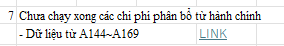

---

## 28. Cập nhật master `原価センタ` — 5 Cost Center mới

> **Nguồn**: Excel gốc sheet `原価センタ`, Row 62-66.
> Đây là 5 Cost Center mới được thêm vào master.

| Cost Center | Tên | No. | 採算区分 | 原価区分 |
|---|---|---|---|---|
| `1412000098` | 電工製造課 | 64 | 製造 | 製造 |
| `1412000096` | ESD2課 | 63 | 製造 | 製造 |
| `1412000099` | MD4課 | 65 | 製造 | 製造 |
| `1412000100` | MD5課 | 68 | 製造 | 製造 |
| `1412000101` | EI2課 | 66 | 製造 | 製造 |

Rule:
- Tất cả 5 CC mới đều thuộc `原価区分 = 製造`.
- Code phải hỗ trợ các CC này khi user chọn từ dropdown.
- Không cần hardcode — chỉ cần đọc master `原価センタ` đầy đủ.

---

## 21. BUG: Chi phí phát thực tế (配布数) bị tính sai bằng headcount delta

**Ngày phát hiện**: 2026-07-07
**Claim từ**: Người dùng claim dòng 61 trong `MP_CC_1412000006.xlsx` (`金型用帽子（白）Mũ trắng tĩnh điện`) không đúng.

### Mô tả vấn đề

Trong file `FY2027配賦額一覧`, có **23 rules** (制服, 帽子, シューズ, 安全靴, v.v.) có `driver_raw` chứa keyword `配布数` (actual distribution count):

> 前月16日から当月15日までの新入社員と**支給依頼者**の**制服配布数**は当月振替

Nghĩa: _"Phân bổ dựa trên **số lượng THỰC TẾ PHÁT RA** cho nhân viên mới + người yêu cầu cấp đổi"_

**Chương trình đang tính SAI**: vì `driver_raw` chứa `新入社員` → `_is_new_hire_driven_rule()=True` → dùng `_get_event_delta()` (headcount delta) làm driver.

Điều này **SAI** vì:
1. **配布数 = số lượng phát thực tế**, KHÔNG PHẢI headcount delta
2. Headcount delta chỉ đếm người mới, bỏ sót **支給依頼者** (người yêu cầu cấp đổi vì hỏng/mất)
3. Không phải tất cả CC đều cần tất cả items (ví dụ: CC kỹ thuật văn phòng không cần mũ tĩnh điện `金型用帽子`)
4. Kết quả: tất cả CC có người mới đều bị allocate chi phí đồng phục/mũ/giày → **phân bổ tràn lan, sai thực tế**

### 23 Rules bị ảnh hưởng

| Rule ID | Item | Unit Price |
|---------|------|-----------|
| 21 | ポケットカレンダー Lịch bỏ túi | 10,935 |
| 22 | 制服（夏） Đồng phục ngắn tay | 165,000 |
| 24 | 制服（冬） Đồng phục dài tay | 175,000 |
| 26 | ポロ制服 Áo Polo | 139,000 |
| 27 | コート制服 Áo khoác | 240,000 |
| 28 | 制服ズボン Quần | 116,000 |
| 29 | 妊婦ズボン Quần bà bầu | 124,500 |
| 30 | 帽子（白） Mũ trắng | 33,500 |
| 31 | 帽子（カラー） Mũ màu | 39,000 |
| 32 | 金型用帽子（白）Mũ trắng tĩnh điện | 47,000 |
| 33 | シューズ（女性） Giày vải nữ | 82,000 |
| 34 | シューズ（男性） Giày vải nam | 84,000 |
| 35 | 大シューズ Giày ngoại cỡ | 120,000 |
| 36 | タイプ1の安全靴 Giày bảo hộ loại 1 | 410,000 |
| 37 | 妊婦用腕章 Băng đeo tay cho người bầu | 27,000 |
| 38 | 保安課の半袖 Áo ngắn tay phòng an ninh | 250,500 |
| 39 | 保安課の長袖 Áo dài tay phòng an ninh | 265,000 |
| 40 | 保安課のズボン Quần phòng an ninh | 129,500 |
| 41 | 保安課のコート Áo khoác phòng an ninh | 240,000 |
| 42 | 保安課の靴 Giày phòng an ninh | 297,600 |
| 43 | 保安課の帽子 Mũ phòng an ninh | 43,200 |
| 50 | 社員旅行不参加対象者へのギフト贈呈 | 1,312,500 |
| 52 | 月餅 Bánh Trung Thu | 56,000 |

### Cách fix

**Nguyên tắc**: Rules có `配布数` trong `driver_raw` → yêu cầu **manual input** (số lượng phát thực tế), KHÔNG auto-calculate từ headcount delta.

**Code fix** (đã áp dụng trong `allocator.py`):
1. Thêm constant `MANUAL_DISTRIBUTION_DRIVER_TOKENS = ("配布数",)`
2. Thêm method `_requires_manual_distribution_count(rule)` → check `driver_raw` chứa `配布数`
3. Trong `_process_allocation_rules()`: skip rules có `配布数` → output = 0 (chờ manual input)

**Kết quả**: 23 rules sẽ **không tự động phân bổ** nữa. Khi cần, user phải cung cấp actual distribution count qua `event_drivers_manual.csv`.
